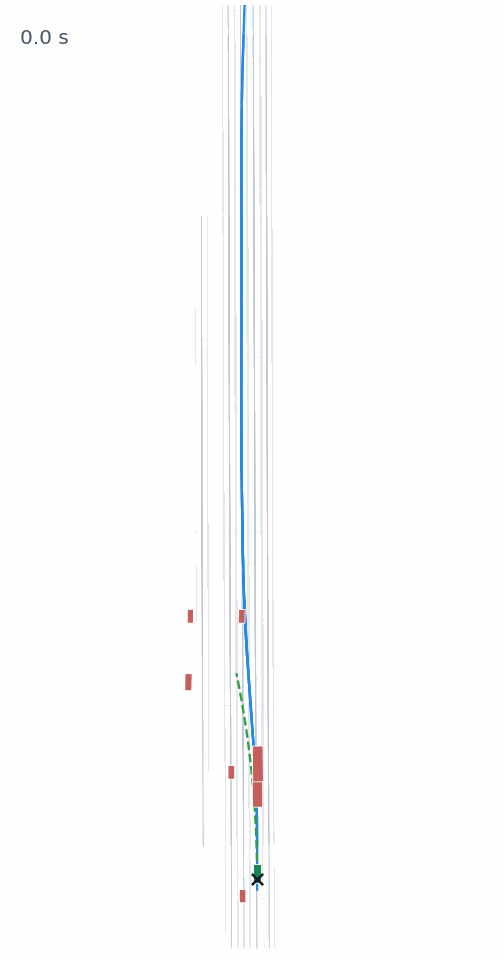

# JEV-Drive：让 JEV 根据结构化场景状态在 AlpaSim 中驾驶

[English](README.md) | 简体中文

JEV-Drive 使用 TypeSafe 的 [JEV](https://docs.typesafe.ai/introduction)，在 NVIDIA 的 [AlpaSim](https://github.com/NVlabs/alpasim) 中控制自车。JEV 读取结构化的自车、车道、周边对象、导航和交通控制信息，选择速度与转向变化；AlpaSim 的 MPC 和车辆动力学执行由此生成的参考轨迹。

**结构化场景状态 → JEV 决策 → 受约束控制 → AlpaSim 运动 → 下一次观测。**

默认使用 [JEV 官方 API](https://docs.typesafe.ai/introduction/quickstart)，模型为 `jev-latest`。策略输入来自结构化仿真状态，不使用 Alpamayo 驾驶模型。

## 运行示例

<p align="center">
  
</p>

JEV Score 阶段性片段：**18 个决策帧，首末相隔 3.4 秒**，使用 [开发客户端](docs/local-development.zh-CN.md) 录制。绿色：自车；红色：其他车辆；蓝色：路线；青色：已行驶路径；绿色虚线：参考轨迹。

## 了解实现

- **[如何让 JEV 输出控制](docs/jev-control.zh-CN.md)**：提问、Score/Choice 回答、指令约束和轨迹生成，附完整数值例子。
- [五模块流程图](docs/full-workflow.zh-CN.md)：各部分如何衔接。
- [BEV 状态图解](docs/bev-state-guide.zh-CN.md)：场景对象与实际输入字段对照。

## 快速开始

需要 **Linux、Python 3.12、已配置好的 AlpaSim 环境、兼容的 USDZ 场景和 TypeSafe API 密钥**。先完成 [安装说明](docs/setup.zh-CN.md)，包括 AlpaSim 运行时补丁，再在仓库根目录运行：

```bash
export JEV_ARTIFACT=/absolute/path/to/scene.usdz
read -rsp 'TypeSafe JEV API key: ' TYPESAFE_API_KEY; echo
export TYPESAFE_API_KEY
scripts/jev-drive --config configs/default.json native-simulate \
  --artifact "$JEV_ARTIFACT" --steps 5 --output outputs/first-run
```

每次运行使用新的输出目录。结果包含决策日志、仿真运动和 BEV 可视化。离线快照、Choice 模式、完整场景、tmux 和外部运行时集成见 [安装与使用](docs/setup.zh-CN.md#使用)。

仓库包含接口代码、配置、运行时补丁和少量文档示例。AlpaSim 环境与完整场景数据需另行准备。可选的 [本地开发适配器](docs/local-development.zh-CN.md) 单独说明。

## 许可证

原创代码和文档采用 [MIT](LICENSE)（[中文参考译文](LICENSE.zh-CN.md)）。AlpaSim 补丁保留适用的 Apache-2.0 条款；场景示例和图片保留其源数据条款。详见 [第三方声明](THIRD_PARTY_NOTICES.zh-CN.md)。
