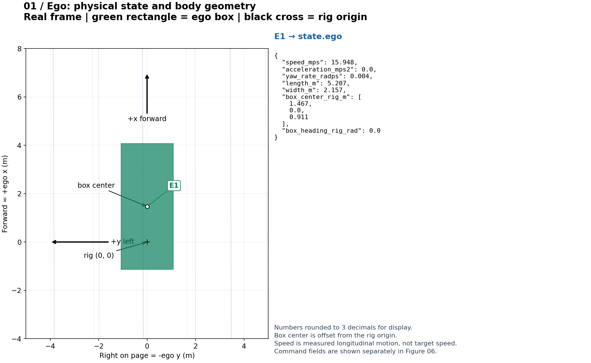
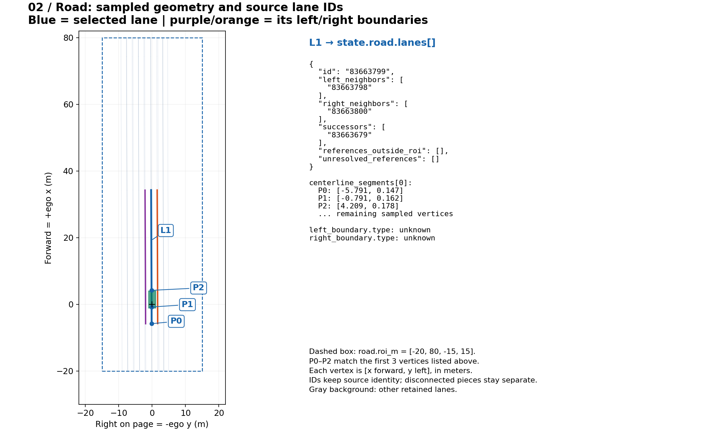
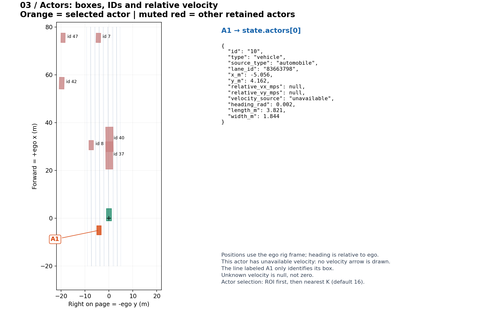
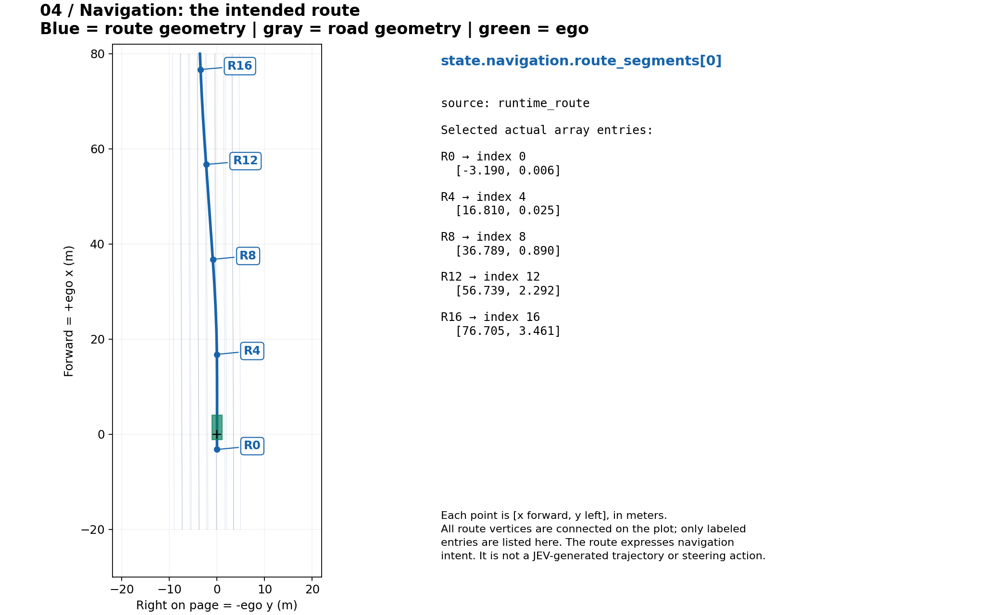
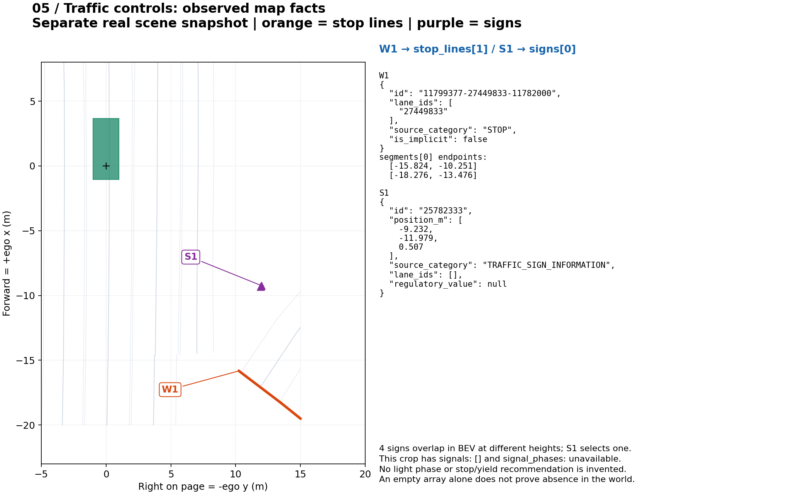
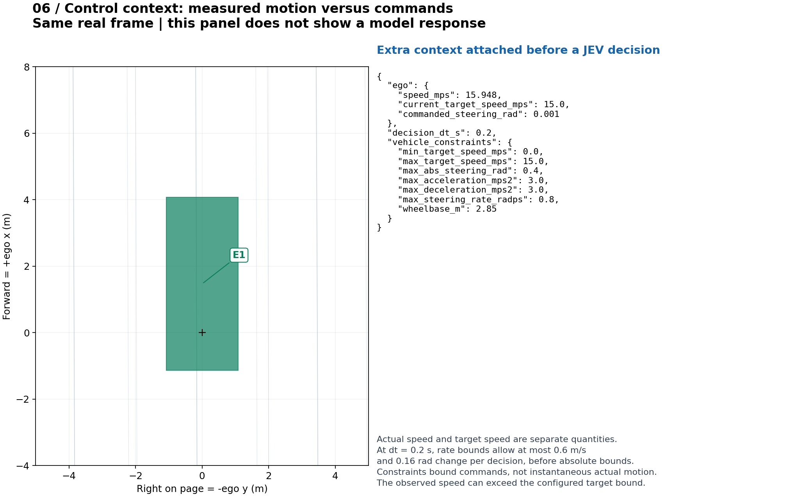

# From a BEV scene to structured fields

Each figure pairs **actual scene geometry on the left** with **the corresponding structured fields on the right**. Colors and labels identify the same objects in both panels. Click an image to inspect the full-resolution PNG.

Figures 01–04 and 06 use the exact input state behind the selected `jev-diagnose-20260926-174329/bev/frame-00000.png`. Figure 05 uses a separate saved scene snapshot because the selected frame's cropped traffic-control arrays are empty. Values are rounded to 3 decimals in labels; the saved JSON retains full precision. These figures show state inputs, not model answers or a driving-quality evaluation.

## 01. Ego state

The green rectangle comes from body dimensions and the box-center offset. The black cross is the rig origin. Coordinates are +x forward and +y left, so the horizontal plotting coordinate is −y.



## 02. Road geometry and lane identity

Blue highlights one retained lane; purple/orange highlight its left/right boundaries. P0–P2 correspond to the first three sampled centerline vertices shown in the right panel. L1 identifies the selected source lane, not a new lane ID.



## 03. Nearby actors

A1 points to the orange vehicle and its actual array entry. Other retained actors are shown with their source IDs. The selected actor's velocity is unavailable in this saved frame, so its relative velocity fields remain `null` and no velocity vector is drawn.



## 04. Navigation route

R0, R4, R8, R12 and R16 label actual indices in `route_segments[0]`. The blue curve is navigation input; it is not a JEV-generated reference trajectory.



## 05. Stop lines and signs

This separate real snapshot contains two stop-line segments and four signs. W1 selects one line; S1 selects one sign. The signs nearly overlap in top view but have different heights. The source category is preserved as recorded; the builder does not manufacture numeric regulatory values or lane associations.



There are no retained signal objects in either illustrated crop. This is represented as `signals: []`, with signal-phase availability `unavailable`; an empty crop is not evidence that the entire world has no traffic lights. For a signal object without a current phase observation, the interface uses `phase: "unknown"`. No synthetic red/green signal has been added to these real-scene figures.

## 06. Command context and constraints

Measured ego speed, the previous target-speed command and the steering command are separate quantities. `JevModel` adds command state and `vehicle_constraints` before the client call. These fields describe how a decision can change the commands, not instantaneous guarantees about physical motion.



## Data and reproducibility

The small examples contain only structured scene state and basic scene metadata; they contain no credentials, API response, model weights or original USDZ archive.

- [Driving frame state](examples/driving-state.json): source for Figures 01–04 and 06.
- [Traffic-control snapshot](examples/traffic-state.json): source for Figure 05.
- [Rendering script](../scripts/render-state-guide.py): draws directly from those JSON files using NumPy and Matplotlib. It requires no simulator, network access or JEV provider.

From an environment with the project dependencies installed:

```bash
python scripts/render-state-guide.py
```

For the complete field schema explanations, see the [structured-state guide](structured-state.md). For how these inputs flow through the simulator and policy, see the [complete workflow](full-workflow.md).
