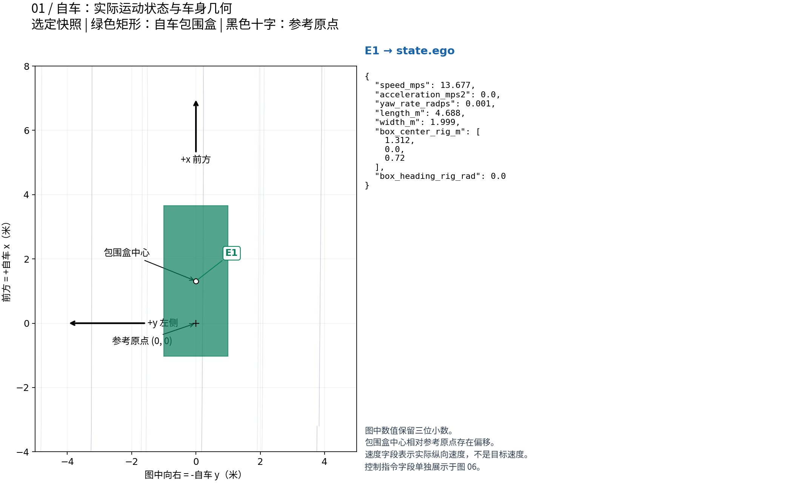
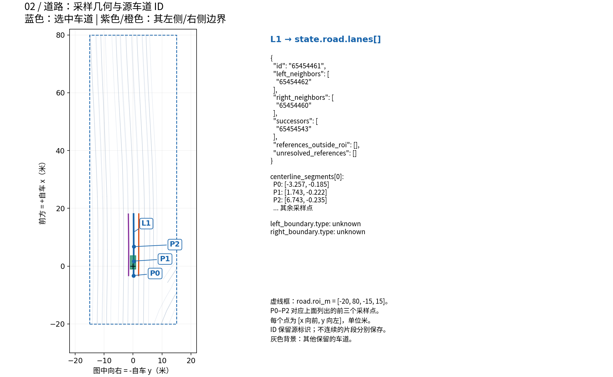
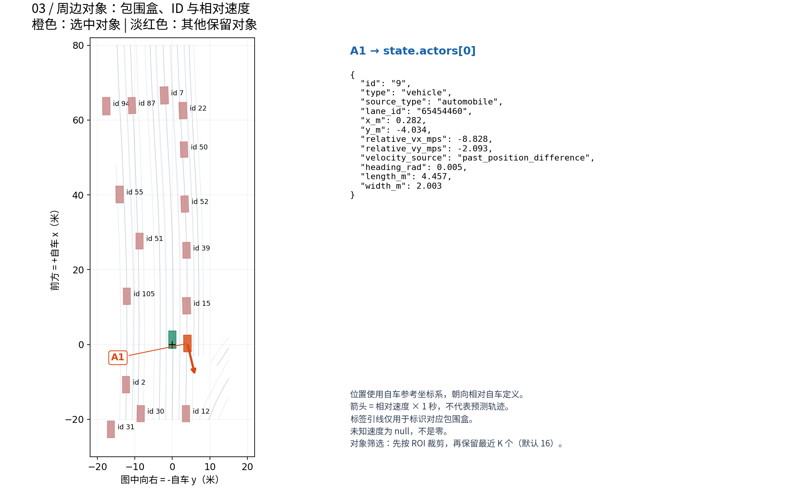
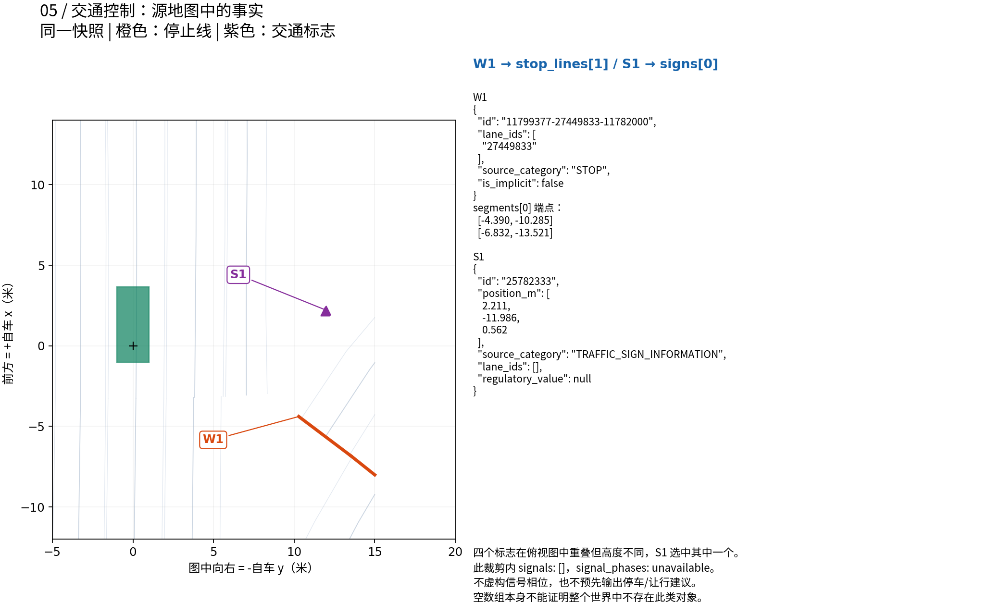
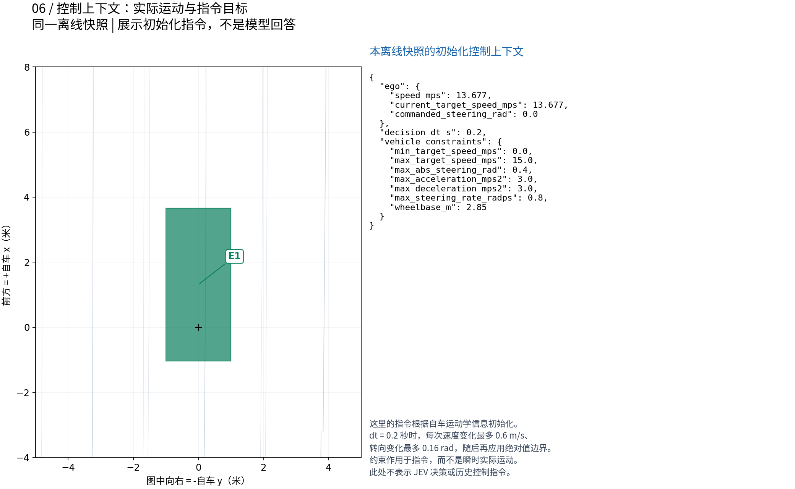

# 从 BEV 场景对应到结构化字段

[English](bev-state-guide.md) | 简体中文

每张图左侧展示**真实场景几何**，右侧展示**对应的结构化字段**。颜色和编号在两侧对应同一个对象。点击图片可以查看原分辨率 PNG。

保留的五张图统一使用场景 `clipgt-01330416-9f29-4799-86a6-c4b2f8593375` 在 **0.2 秒时的一份离线快照**。选它是因为包含 16 个具有速度估计的周边对象、两条停止线和四个标志。图中数值保留三位小数，JSON 示例保留完整精度。没有调用 JEV API。图 06 的控制上下文由 `ControlState.initialize` 根据快照初始化，不代表之前的真实决策。

本页图示保留历史快照；旧导航折线图已移除，当前导航格式见第 04 节。绘图脚本仍可复现旧版六张图，旧导航图不代表当前输入。

## 01. 自车状态

绿色矩形由车身尺寸和包围盒中心偏移构成，黑色十字是自车参考坐标系原点。+x 向前、+y 向左，因此图的横坐标为 −y。



`speed_mps` 是纵向速度分量。车身几何、实际运动和控制目标是不同量。构建器：[ego.py](../src/jev_drive/state/ego.py)。

## 02. 道路几何和车道标识

蓝色突出一条保留车道，紫色/橙色分别为其左右边界。P0–P2 对应右侧列出的前三个中心线采样点。L1 是图中的选择标记，不会替代原始车道 ID。



`roi_m` 按 `[x_min, x_max, y_min, y_max]` 排列，单位米；道路默认裁剪范围为 `[-20, 80, -15, 15]`。中心线默认每 5 米采样并保留端点。不连续 `segments` 不能跨空隙连线。邻道和后继 ID 保留源拓扑；`references_outside_roi` 与 `unresolved_references` 含义不同。构建器：[road_graph.py](../src/jev_drive/state/road_graph.py)。

## 03. 周边对象

A1 指向橙色车辆及其真实数组项；其他对象标有源 ID。速度箭头将选中对象的相对速度乘以一秒以便展示，它是向量示意，不是预测轨迹。标签引线只用于标识包围盒。



对象默认裁剪范围为 `[-30, 80, -20, 20]`，最多保留最近的 16 个。相对速度等于对象速度减自车速度，再旋转到自车坐标轴；不含旋转坐标系位置导数的额外修正。未知速度为 `null`，缺失或歧义车道匹配返回 `lane_id: null`。构建器：[actors.py](../src/jev_drive/state/actors.py)、[lane_matching.py](../src/jev_drive/state/lane_matching.py)。

## 04. 道路级导航

导航现改为按顺序提供相邻同向车道 ID 的道路组，不再输入 GT 路径折线。JEV 根据地图和交通自行选择车道与换道时机。默认只用行程终点选定目标道路，中间 GT 路径点不参与。输入示例、目的地配置和地图不可用时的处理见[道路级导航](navigation.zh-CN.md)。

## 05. 停止线和交通标志

同一快照包含两条停止线和四个标志。W1 选中一条线，S1 选中一个标志。标志在俯视图中几乎重叠，但高度不同。类别保留原始记录值；构建器不会凭空补充数值型交通规则或车道关联。



该裁剪范围没有保留的信号灯对象，因此表示为 `signals: []`，信号相位可用性为 `unavailable`。空数组不意味着整个世界不存在信号灯。对于有几何对象但没有当前相位观测的信号灯，接口使用 `phase: "unknown"`。这些真实场景图中没有添加虚构的红绿灯。

信号观测不能晚于当前时刻。默认有效期为 1 秒；过期样本保留时间戳和来源，但返回 `phase: "unknown"` 与 `phase_stale: true`。数据可用性与对象数组分别记录。构建器：[traffic_signals.py](../src/jev_drive/state/traffic_signals.py)、[stop_lines.py](../src/jev_drive/state/stop_lines.py)、[traffic_signs.py](../src/jev_drive/state/traffic_signs.py)。

## 06. 控制上下文和约束

实际自车速度与控制目标是不同量。本离线示例用 `ControlState.initialize` 从快照初始化目标速度和转向，再加入 `JevModel` 调用客户端前会提供的 `vehicle_constraints` 和时间字段。它们限定指令如何变化，不直接保证车辆瞬时运动。



默认每 0.2 秒决策，目标速度变化最多 0.6 m/s，转向变化最多 0.16 rad，随后应用绝对值边界。实现见 [vehicle_constraints.py](../src/jev_drive/state/vehicle_constraints.py) 和 [limits.py](../src/jev_drive/control/limits.py)。

### 在哪里查看完整状态

构建器生成带版本封装（`kind: jev.scene_snapshot`、`schema_version: 1`），通过 `DriveRequest.renderer_data` 传输。其 `state` 包含五类场景信息，会话、时间、坐标系元数据和来源另行保存。`JevModel` 在调用客户端前补充控制字段、车辆约束及时间信息。原始渲染字节不发送给 JEV。

`outputs/<snapshot>/state.json` 可查看构建器封装；`outputs/<run>/decisions.jsonl` 中决策事件的 `state` 是含补充上下文的实际模型输入。实现见 [state_builder.py](../src/jev_drive/state/state_builder.py)、[schema.py](../src/jev_drive/state/schema.py) 和 [jev_model.py](../src/jev_drive/policy/jev_model.py)。

## 数据与复现

示例仅含结构化场景状态和基本元数据，不含密钥、API 回答、模型权重或原始 USDZ 文件。

- [选中快照及初始化控制上下文](examples/driving-state.json)：历史图示的共同来源。
- [绘图脚本](../scripts/render-state-guide.py)：用 NumPy 和 Matplotlib 直接读取 JSON，无需仿真器、网络或 JEV 服务。

在已安装项目依赖的环境中运行：

```bash
python scripts/render-state-guide.py
```

默认生成英文版。生成中文版时，系统需安装 Noto Sans CJK 字体；也可用 `JEV_DOC_FONT` 指定支持中文的字体文件：

```bash
python scripts/render-state-guide.py --language zh-CN
```

输入如何进入策略和仿真器见 [JEV-Drive 实现流程](full-workflow.zh-CN.md)。

源目标框的重叠可在模型输入前过滤，详见[目标过滤与离线对比](actor-filter.zh-CN.md)。
