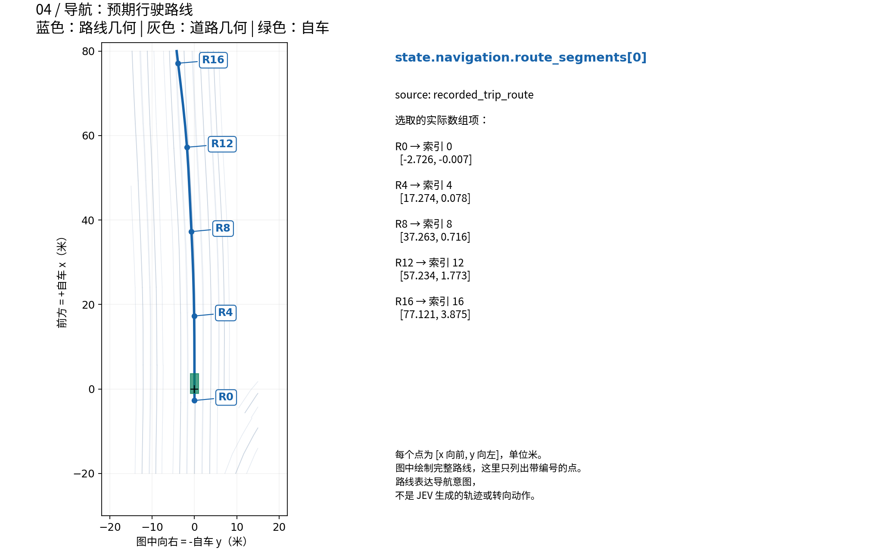

# 从 BEV 场景对应到结构化字段

[English](bev-state-guide.md) | 简体中文

每张图左侧展示**真实场景几何**，右侧展示**对应的结构化字段**。颜色和编号在两侧对应同一个对象。点击图片可以查看原分辨率 PNG。

六张图统一使用场景 `clipgt-01330416-9f29-4799-86a6-c4b2f8593375` 在 **0.2 秒时的一份离线快照**。选它是因为包含 16 个具有速度估计的周边对象、两条停止线和四个标志。图中数值保留三位小数，JSON 示例保留完整精度。没有调用 JEV API。图 06 的控制上下文由 `ControlState.initialize` 根据快照初始化，不代表之前的真实决策。

## 01. 自车状态

绿色矩形由车身尺寸和包围盒中心偏移构成，黑色十字是自车参考坐标系原点。+x 向前、+y 向左，因此图的横坐标为 −y。


## 02. 道路几何和车道标识

蓝色突出一条保留车道，紫色/橙色分别为其左右边界。P0–P2 对应右侧列出的前三个中心线采样点。L1 是图中的选择标记，不会替代原始车道 ID。


## 03. 周边对象

A1 指向橙色车辆及其真实数组项；其他对象标有源 ID。速度箭头将选中对象的相对速度乘以一秒以便展示，它是向量示意，不是预测轨迹。标签引线只用于标识包围盒。


## 04. 导航路线

R0、R4、R8、R12、R16 标记 `route_segments[0]` 中的实际索引。蓝线是导航输入，不是 JEV 生成的参考轨迹。



## 05. 停止线和交通标志

同一快照包含两条停止线和四个标志。W1 选中一条线，S1 选中一个标志。标志在俯视图中几乎重叠，但高度不同。类别保留原始记录值；构建器不会凭空补充数值型交通规则或车道关联。


该裁剪范围没有保留的信号灯对象，因此表示为 `signals: []`，信号相位可用性为 `unavailable`。空数组不意味着整个世界不存在信号灯。对于有几何对象但没有当前相位观测的信号灯，接口使用 `phase: "unknown"`。这些真实场景图中没有添加虚构的红绿灯。

## 06. 控制上下文和约束

实际自车速度与控制目标是不同量。本离线示例用 `ControlState.initialize` 从快照初始化目标速度和转向，再加入 `JevModel` 调用客户端前会提供的 `vehicle_constraints` 和时间字段。它们限定指令如何变化，不直接保证车辆瞬时运动。


## 数据与复现

示例仅含结构化场景状态和基本元数据，不含密钥、API 回答、模型权重或原始 USDZ 文件。

- [选中快照及初始化控制上下文](examples/driving-state.json)：六张图的共同来源。
- [绘图脚本](../scripts/render-state-guide.py)：用 NumPy 和 Matplotlib 直接读取 JSON，无需仿真器、网络或 JEV 服务。

在已安装项目依赖的环境中运行：

```bash
python scripts/render-state-guide.py
```

默认生成英文版。生成中文版时，系统需安装 Noto Sans CJK 字体；也可用 `JEV_DOC_FONT` 指定支持中文的字体文件：

```bash
python scripts/render-state-guide.py --language zh-CN
```

字段语义见 [结构化状态说明](structured-state.zh-CN.md)，输入如何进入策略和仿真器见 [完整实现流程](full-workflow.zh-CN.md)。
