# Complete implementation workflow

The implemented `native-simulate` path connects AlpaSim scene state to a **replaceable JEV client**, then executes the resulting reference through AlpaSim's MPC and vehicle dynamics. The data and control interfaces do not require a particular JEV service provider. The CLI defaults to the official TypeSafe JEV API; alternate clients are selected explicitly through the client factory.

## End-to-end flow

```mermaid
flowchart TD
    START["Start native-simulate<br/>configuration + scene artifact + requested steps + output path"]
    subgraph SETUP["1. Initialize"]
        CFG["Load configuration and configured client implementation"]
        CHECK["Check runtime patch and output path<br/>load scene artifact and internal scene ID"]
        SERVER["Start local JEV driver and MPC/controller services<br/>create session and event loop"]
        WARM["Recorded-motion warmup<br/>one 0.2-second step by default; no JEV decision"]
        CFG --> CHECK --> SERVER --> WARM
    end
    START --> CFG
    subgraph STATE["2. Construct structured input"]
        CURRENT["AlpaSim current ego and actor state<br/>map, route and available traffic-control facts"]
        SNAP["Runtime hook → AlpasimAdapter → SceneSnapshot"]
        BUILD["Independent builders<br/>ego / road / actors / navigation / traffic_controls"]
        WIRE["Versioned envelope in DriveRequest.renderer_data<br/>validate session, timestamps, frame and schema"]
        CONTEXT["JevModel adds command state<br/>vehicle constraints and decision timing"]
        CURRENT --> SNAP --> BUILD --> WIRE --> CONTEXT
    end
    WARM --> CURRENT
    subgraph POLICY["3. Request a JEV decision"]
        CLIENT["Client contract: async decide(state, questions)<br/>provider-specific transport stays behind this boundary"]
        ANSWER["Validate returned speed and steering answers<br/>finite values, ranges and probabilities"]
        VALID{"Valid decision?"}
        CLIENT --> ANSWER --> VALID
    end
    CONTEXT --> CLIENT
    subgraph ACTION["4. Execute bounded control"]
        MAP["Score / Choice mapping<br/>speed and steering increments"]
        LIMIT["Rate limits, then absolute bounds<br/>default speed increment at most 0.6 m/s per step"]
        REF["Build reference trajectory<br/>default horizon 4 s, sampled at 10 Hz"]
        SAVE["Log decision; update command state<br/>cache identical duplicate requests"]
        RPC["Convert reference from ego to world frame<br/>return trajectory through driver gRPC"]
        MPC["AlpaSim MPC and vehicle dynamics<br/>execute the next 0.2-second interval"]
        STEP["Update actual ego motion and recorded traffic"]
        MORE{"More steps?"}
        MAP --> LIMIT --> REF --> SAVE --> RPC --> MPC --> STEP --> MORE
    end
    VALID -->|Yes| MAP
    MORE -->|Yes| CURRENT
    subgraph RESULTS["5. Results and cleanup"]
        LOG["During rollout: structured inputs, decisions and outcomes<br/>decisions.jsonl + controller CSV + native rollout logs"]
        COUNT{"Completed requested decision count?"}
        SUCCESS["Mark rollout successful"]
        FAIL["Stop rollout on terminal error<br/>retain available diagnostics; no substitute driving policy"]
        FINAL["Write summary and completed count<br/>stop services; restore environment"]
        EXPORT["On successful return: export BEV frames and GIF<br/>close client when CLI exits"]
        COUNT -->|Yes| SUCCESS --> FINAL
        COUNT -->|No| FAIL
        FAIL --> FINAL
        FINAL --> EXPORT
    end
    MORE -->|No| COUNT
    VALID -->|No| FAIL
    CLIENT -. "terminal client error" .-> FAIL
    WIRE -. "invalid input" .-> FAIL
    MPC -. "simulation error" .-> FAIL
    SAVE -.-> LOG
    STEP -.-> LOG
```



The next cycle observes actual simulator motion, rather than assuming the reference was followed exactly. The 4-second trajectory is regenerated every decision; only the next control interval is executed before the next observation. The currently configured 20-second recording uses a 0.2-second warmup and 99 decisions. Other recordings require an appropriate step count.

Errors during initialization can occur before the rollout summary finalizer is established. After the guarded rollout begins, finalization writes the completion summary. Failed runs keep available logs but do not automatically export the success-path BEV/GIF.

## Replaceable JEV client

`JevModel` receives a client object rather than implementing provider authentication or HTTP calls itself:

```python
model = JevModel(config, client, logger)
# Internally:
response = await client.decide(state, questions)
```

A replacement implements `async decide(state, questions)` and returns the answer mapping expected by [Score](../src/jev_drive/control/score_control.py) or [Choice](../src/jev_drive/control/choice_control.py) conversion. Inspect [the existing client](../src/jev_drive/policy/jev_client.py) and [client tests](../tests/test_jev_client.py) for the current response contract. The CLI additionally calls `async close()`. The official client reads `TYPESAFE_API_KEY` and calls `https://api.typesafe.ai/v1/systemone` with model `jev-latest`.

The factory in [client_factory.py](../src/jev_drive/policy/client_factory.py) selects `JevClient` for the default `backend: "typesafe"`. To add another service, implement its authentication/request/response translation and register its client and configuration defaults. Scene builders, control mapping and AlpaSim integration do not change. Provider selection never depends on which API keys happen to be exported, and no automatic provider fallback occurs. See [local development](local-development.md) for the explicitly selected development adapter.

## Code map

| Stage | Implementation |
|---|---|
| CLI and client construction | [cli.py](../src/jev_drive/cli.py) |
| Native services, warmup and rollout lifecycle | [native_simulation.py](../src/jev_drive/integration/native_simulation.py) |
| Runtime bridge and simulator adapter | [runtime_bridge.py](../src/jev_drive/integration/runtime_bridge.py), [alpasim_adapter.py](../src/jev_drive/integration/alpasim_adapter.py) |
| State builders and schema | [state/](../src/jev_drive/state/) |
| gRPC driver and coordinate conversion | [driver_service.py](../src/jev_drive/integration/driver_service.py) |
| Policy and questions | [jev_model.py](../src/jev_drive/policy/jev_model.py), [questions.py](../src/jev_drive/policy/questions.py) |
| Official client and provider selection | [jev_client.py](../src/jev_drive/policy/jev_client.py), [client_factory.py](../src/jev_drive/policy/client_factory.py) |
| Command mapping and reference trajectory | [control/](../src/jev_drive/control/) |
| Output logging and BEV | [decision_log.py](../src/jev_drive/logging/decision_log.py), [bev.py](../src/jev_drive/visualization/bev.py) |

See the [real-scene BEV field guide](bev-state-guide.md) to match visible scene elements to structured values.

This native launcher uses privileged structured inputs and recorded, nonreactive traffic, with rendering and ground-contact correction disabled. Successful completion does not establish collision-free or rule-compliant driving. The `simulate` harness and independent `serve` mode are alternative entry points; the diagram above describes `native-simulate`.
