# Complete implementation workflow

This diagram describes the implemented **`native-simulate`** path with `configs/full-scene.json`: real JEV via Vercel AI Gateway, the native AlpaSim event loop, local gRPC services and recorded traffic. It is a code-path diagram, not a claim that a full live JEV scene has completed successfully.

## End-to-end flow

```mermaid
flowchart TD
    START["Launch native-simulate<br/>config + USDZ artifact + requested steps + new output directory"]

    subgraph SETUP["1. Startup and simulation setup"]
        CFG["Load Config; create JevClient<br/>read AI_GATEWAY_API_KEY from environment"]
        CHECK["Check patched AlpaSim runtime<br/>validate step count and output directory"]
        SCENE["Load USDZ and internal scene ID<br/>save jev-config.json + scene-manifest.json"]
        SERVER["Start local JEV driver and MPC/controller gRPC servers<br/>create JevModel and per-session state"]
        LOOP["Create EventBasedRollout<br/>recorded traffic; recorded route; no cameras<br/>ground-contact correction and evaluator disabled"]
        WARM["One recorded-motion warmup step<br/>0.2 s by default; skip JEV during warmup"]
        CFG --> CHECK --> SCENE --> SERVER --> LOOP --> WARM
    end
    START --> CFG

    subgraph INPUT["2. Build one decision input at simulation time t"]
        POLICY["AlpaSim PolicyEvent<br/>JEV_DRIVE_ENABLED runtime hook"]
        SNAP["AlpasimAdapter.from_runtime<br/>current ego/actors + past motion + map + route<br/>optional past/current signal annotations"]
        BUILD["Independent builders<br/>ego, road, actors, navigation, traffic_controls<br/>ego-frame transform, ROI crop and availability fields"]
        WIRE["Versioned JSON envelope<br/>DriveRequest.renderer_data"]
        RPC["Driver receives current egomotion + drive RPC<br/>check session, schema, frame and timestamps"]
        MODEL["JevModel validates ordering and decision interval<br/>initialize or reuse command state"]
        ENRICH["Add previous target speed and steering command<br/>vehicle limits, timestamp, interval and coordinate frame"]
        POLICY --> SNAP --> BUILD --> WIRE --> RPC --> MODEL --> ENRICH
    end
    WARM --> POLICY

    subgraph API["3. JEV request and waiting"]
        REQUEST["JevClient: pace request starts<br/>POST Vercel /v1/evaluate<br/>model: typesafe-ai/jev<br/>state + speed/steering questions"]
        STATUS{"Request result?"}
        RETRY{"HTTP 429 retry enabled?"}
        WAIT["Log api_retry; wait Retry-After if valid<br/>otherwise 5, 10, 20, 40, then 60 s<br/>same frozen request; no simulation advance"]
        VALID["Validate response and answers<br/>required keys, finite values, ranges and probabilities"]
        OK{"Valid?"}
        REQUEST --> STATUS
        STATUS -->|"HTTP 429"| RETRY
        RETRY -->|Yes| WAIT
        WAIT --> REQUEST
        STATUS -->|"HTTP 200"| VALID
        VALID --> OK
    end
    ENRICH --> REQUEST

    subgraph CONTROL["4. Convert the decision and simulate motion"]
        MAP["Map Score or Choice answer to<br/>target-speed and steering increments"]
        LIMIT["Apply rate bounds, then absolute bounds<br/>default speed change at most 0.6 m/s per decision<br/>steering change at most 0.16 rad per decision"]
        TRAJ["Generate ego-local reference trajectory<br/>default horizon 4 s, sampled at 10 Hz"]
        DECISION["Write decision event; update session command state<br/>cache result for an identical duplicate request"]
        WORLD["Driver converts trajectory to world poses<br/>prepend current pose; return DriveResponse"]
        MPC["AlpaSim controller RPC<br/>MPC + vehicle dynamics execute the next interval"]
        STEP["Runtime traffic and step events<br/>advance ego and recorded actors by 0.2 s"]
        MORE{"More scheduled steps?"}
        MAP --> LIMIT --> TRAJ --> DECISION --> WORLD --> MPC --> STEP --> MORE
    end
    OK -->|Yes| MAP
    MORE -->|Yes| POLICY

    subgraph OUTPUT["5. Completion, errors and artifacts"]
        LIVE["During rollout<br/>decisions.jsonl: decisions, retries, outcomes, failures<br/>controller CSV + native rollout.asl"]
        COUNT{"Event loop returned and<br/>completed decisions = requested steps?"}
        PASS["Mark summary success = true"]
        FAIL["Terminate this rollout<br/>retain available failure details<br/>no alternative policy or automatic rollout restart"]
        CLEAN["Rollout finalization<br/>write summary.json and completed count<br/>stop local servers; restore runtime environment"]
        RETURN{"Native run returned successfully?"}
        BEV["CLI prints summary and exports<br/>BEV PNG frames, frames.json and rollout.gif"]
        END["CLI closes JEV HTTP client<br/>process ends; tmux shell can remain open"]
        COUNT -->|Yes| PASS --> CLEAN
        COUNT -->|No| FAIL
        FAIL --> CLEAN
        CLEAN --> RETURN
        RETURN -->|Yes| BEV --> END
        RETURN -->|No| END
    end
    MORE -->|No| COUNT
    STATUS -->|"Other HTTP / transport error"| FAIL
    RETRY -->|No| FAIL
    OK -->|No| FAIL
    RPC -. "validation failure" .-> FAIL
    MODEL -. "conflicting or out-of-order input" .-> FAIL
    MPC -. "simulation error" .-> FAIL
    WAIT -. "retry record" .-> LIVE
    DECISION -. "decision record" .-> LIVE
    MPC -. "actual motion outcomes" .-> LIVE
    STEP -. "native runtime logs" .-> LIVE
```



Solid arrows show the normal control flow and explicit error branches. Dotted arrows show logging or selected exceptional paths. Initialization errors stop before the loop; the rollout `summary.json` finalizer exists only once setup has reached the guarded rollout section. Cancellation also stops the run; it does not resume it automatically.

## How to read one cycle

1. **Observe:** use the current simulator state and past motion. Static map and route intent can extend ahead; future actor motion and future signal phases are excluded from the policy input.
2. **Structure:** builders convert source geometry into ego-relative facts. The runtime sends a versioned envelope through the existing gRPC request field; no new protobuf field is required.
3. **Decide:** JEV receives the structured state and both control questions in one HTTP request. Only `policy/jev_client.py` owns the Vercel transport logic.
4. **Wait if needed:** a 429 retry repeats the same state and questions. The current decision waits; it does not apply another control increment or advance simulation time. A valid `Retry-After` may exceed the fallback 60-second cap. Other errors remain fatal.
5. **Act:** interpret the valid answer, bound the control changes, and create a reference trajectory. AlpaSim's MPC and dynamics produce the actual motion; JEV does not directly set the next vehicle pose.
6. **Repeat:** the next policy call observes the resulting state. An identical same-timestamp request can return its cached result without another JEV call; conflicting/stale requests fail.

## Simulation time versus wall-clock time

```mermaid
sequenceDiagram
    participant R as AlpaSim runtime
    participant D as JEV driver
    participant G as Vercel JEV
    participant C as MPC / dynamics
    R->>D: Current state at t; query next interval
    D->>G: State at t + control questions
    G-->>D: HTTP 429
    Note over R,D: Simulation step waits at t
    Note over D,G: Wait Retry-After or exponential backoff
    D->>G: Same state at t + same questions
    G-->>D: Valid decision
    D->>D: Apply one bounded command update
    D-->>R: Reference trajectory, horizon 4 s
    R->>C: Execute next control interval
    C-->>R: Actual ego motion
    R->>R: Update traffic / step state
    Note over R,C: Next policy observation at t + 0.2 s
```

For the currently configured 20-second recording, the run consists of **0.2 seconds of warmup + 99 × 0.2 seconds of closed-loop simulation**. Wall-clock duration can be much longer because API calls and retries take real time. The 4-second reference is regenerated each decision; it is not executed for 4 seconds before asking JEV again. Default and Choice configurations fail immediately on 429; the full-scene configuration enables the waiting branch shown above.

## Code map

| Stage | Implementation |
|---|---|
| CLI, configuration and client lifecycle | [cli.py](../src/jev_drive/cli.py), [config.py](../src/jev_drive/config.py) |
| Native services, warmup and rollout lifecycle | [native_simulation.py](../src/jev_drive/integration/native_simulation.py) |
| Runtime hook and snapshot construction | [AlpaSim patch](../patches/alpasim-jev-runtime.patch), [runtime_bridge.py](../src/jev_drive/integration/runtime_bridge.py), [alpasim_adapter.py](../src/jev_drive/integration/alpasim_adapter.py) |
| Input assembly and transport validation | [state_builder.py](../src/jev_drive/state/state_builder.py), [schema.py](../src/jev_drive/state/schema.py) |
| gRPC boundary and trajectory coordinates | [driver_service.py](../src/jev_drive/integration/driver_service.py) |
| Policy and command state | [jev_model.py](../src/jev_drive/policy/jev_model.py), [questions.py](../src/jev_drive/policy/questions.py) |
| Vercel request and retry policy | [jev_client.py](../src/jev_drive/policy/jev_client.py), [retry.py](../src/jev_drive/policy/retry.py) |
| Score/Choice conversion and constraints | [control/](../src/jev_drive/control/) |
| Reference trajectory | [trajectory.py](../src/jev_drive/control/trajectory.py) |
| Decision logs and BEV export | [decision_log.py](../src/jev_drive/logging/decision_log.py), [bev.py](../src/jev_drive/visualization/bev.py) |

For individual fields and their meaning, see the [structured-state visual guide](structured-state.md).

`success: true` means the requested simulation completed; it is not a collision-free or traffic-rule compliance result. This implementation uses privileged structured inputs and recorded, nonreactive traffic, with rendering and ground-contact correction disabled. The smaller `simulate` harness and the independently hosted `serve` mode are alternative entry points; the diagram above specifically describes `native-simulate`.
