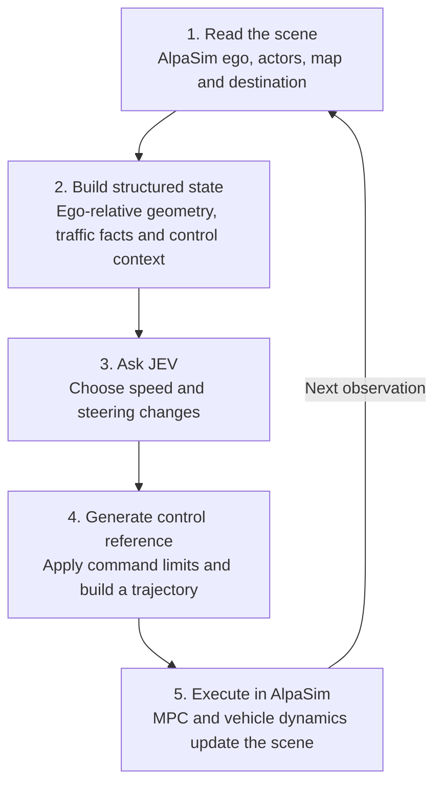

# How JEV-Drive works

English | [简体中文](full-workflow.zh-CN.md)

JEV-Drive connects a structured view of the driving scene to JEV decisions, then uses AlpaSim to execute those decisions in a closed loop.

| Module | What we implement |
|---|---|
| Read the scene | [The adapter](../src/jev_drive/integration/alpasim_adapter.py) reads current simulator state, past motion, map geometry and the destination. |
| Build structured state | Separate [state builders](../src/jev_drive/state/) assemble ego, road, actors, map-derived road-corridor navigation and traffic controls. [The runtime bridge](../src/jev_drive/integration/runtime_bridge.py) passes this state to the driver. |
| Ask JEV | [JevModel](../src/jev_drive/policy/jev_model.py) adds command context and questions, then calls the [official JEV client](../src/jev_drive/policy/jev_client.py) for speed/steering decisions. |
| Generate control reference | [Control modules](../src/jev_drive/control/) convert answers into bounded command increments and a reference trajectory. |
| Execute and observe again | [The native integration](../src/jev_drive/integration/native_simulation.py) runs AlpaSim's MPC and dynamics. Actual resulting motion becomes the next observation. |

The core decision-to-control conversion in steps 3–4 is explained in [From JEV answers to driving control](jev-control.md), including the actual scoring rubric and a worked update.

At the default settings, this loop makes one decision per 0.2 seconds of simulation. JEV selects command changes; AlpaSim produces the vehicle motion. Logs and BEV images let users inspect the inputs, decisions and outcomes.

See the [BEV state guide](bev-state-guide.md) for the scene elements and structured fields used in step 2, and the [README](../README.md#quick-start) to run the implementation.
