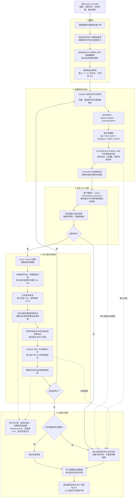

# 完整实现流程

[English](full-workflow.md) | 简体中文

`native-simulate` 将 AlpaSim 场景状态交给**可替换的 JEV 客户端**，再由 AlpaSim 的 MPC 和车辆动力学执行所得参考轨迹。数据和控制接口不依赖特定服务提供方。CLI 默认使用 TypeSafe JEV 官方 API，其他客户端由工厂显式选择。

## 端到端流程



下一轮读取实际仿真运动，而非假定车辆完全跟随参考轨迹。每次决策重新生成 4 秒轨迹，只执行下一个控制区间就再次观测。当前配置的 20 秒场景包含 0.2 秒预热和 99 次决策，其他场景需要设置合适步数。

初始化错误可能发生在摘要清理逻辑建立之前。进入受保护的仿真阶段后，结束时会写入完成摘要。失败运行保留可用日志，但不会自动执行成功路径的 BEV/GIF 导出。

## 可替换的 JEV 客户端

`JevModel` 接收客户端对象，不自行实现服务方鉴权或 HTTP 调用：

```python
model = JevModel(config, client, logger)
# 模型内部调用：
response = await client.decide(state, questions)
```

替换实现需提供 `async decide(state, questions)`，返回 [Score](../src/jev_drive/control/score_control.py) 或 [Choice](../src/jev_drive/control/choice_control.py) 转换所需的回答映射。当前契约见 [现有客户端](../src/jev_drive/policy/jev_client.py) 和 [客户端测试](../tests/test_jev_client.py)。CLI 还会调用 `async close()`。官方客户端读取 `TYPESAFE_API_KEY`，以模型 `jev-latest` 调用 `https://api.typesafe.ai/v1/systemone`。

[client_factory.py](../src/jev_drive/policy/client_factory.py) 为默认的 `backend: "typesafe"` 选择 `JevClient`。增加其他服务时，实现其鉴权、请求和响应转换，并注册客户端及默认配置；场景构建、控制映射和 AlpaSim 集成不必改动。后端选择不会取决于恰好导出了哪个密钥，也不会自动切换服务方。显式选择开发适配器的方式见 [本地开发说明](local-development.zh-CN.md)。

## 代码对应关系

| 阶段 | 实现 |
|---|---|
| CLI 和客户端创建 | [cli.py](../src/jev_drive/cli.py) |
| 原生服务、预热及仿真生命周期 | [native_simulation.py](../src/jev_drive/integration/native_simulation.py) |
| 运行时桥接和仿真器适配 | [runtime_bridge.py](../src/jev_drive/integration/runtime_bridge.py)、[alpasim_adapter.py](../src/jev_drive/integration/alpasim_adapter.py) |
| 状态构建和结构校验 | [state/](../src/jev_drive/state/) |
| gRPC 驱动和坐标转换 | [driver_service.py](../src/jev_drive/integration/driver_service.py) |
| 策略和问题 | [jev_model.py](../src/jev_drive/policy/jev_model.py)、[questions.py](../src/jev_drive/policy/questions.py) |
| 官方客户端及后端选择 | [jev_client.py](../src/jev_drive/policy/jev_client.py)、[client_factory.py](../src/jev_drive/policy/client_factory.py) |
| 控制映射和参考轨迹 | [control/](../src/jev_drive/control/) |
| 输出日志和 BEV | [decision_log.py](../src/jev_drive/logging/decision_log.py)、[bev.py](../src/jev_drive/visualization/bev.py) |

[真实场景 BEV 字段对照](bev-state-guide.zh-CN.md) 将可见场景对象与结构化数值一一对应。

此启动器使用仿真器直接提供的结构化信息，其他交通参与者按录制轨迹回放，不响应自车；渲染和地面接触修正关闭。完成仿真不代表无碰撞或符合所有交通规则。`simulate` 和独立的 `serve` 是其他入口，上图专门描述 `native-simulate`。
