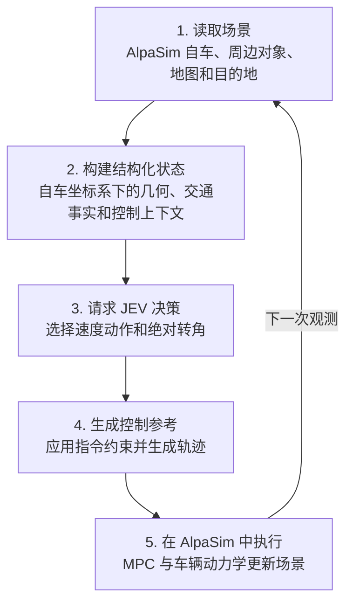

# JEV-Drive 如何实现

[English](full-workflow.md) | 简体中文

JEV-Drive 将驾驶场景整理成结构化输入，让 JEV 做决策，再由 AlpaSim 执行，形成持续观测和控制的闭环。

| 模块 | 我们实现的内容 |
|---|---|
| 读取场景 | [适配器](../src/jev_drive/integration/alpasim_adapter.py) 读取当前仿真状态、过去运动、地图几何和目的地。 |
| 构建结构化状态 | 独立的 [状态构建器](../src/jev_drive/state/) 组装自车、道路、对象、基于地图的道路组导航和交通控制；[运行时桥接](../src/jev_drive/integration/runtime_bridge.py) 将状态传给驱动。 |
| 请求 JEV 决策 | [JevModel](../src/jev_drive/policy/jev_model.py) 添加控制上下文和问题，通过 [官方 JEV 客户端](../src/jev_drive/policy/jev_client.py) 获取速度与转向决策。 |
| 生成控制参考 | [控制模块](../src/jev_drive/control/) 将回答转换为受约束的速度更新、绝对转角目标和渐变速度参考轨迹。 |
| 执行并再次观测 | [原生集成](../src/jev_drive/integration/native_simulation.py) 运行 AlpaSim 的 MPC 和车辆动力学，实际运动结果成为下一次观测。 |

第 3–4 步的核心转换见 [从 JEV 回答到驾驶控制](jev-control.zh-CN.md)，其中包含实际评分标准和完整指令更新示例。

默认每 0.2 秒仿真时间决策一次。JEV 选择速度动作和转角目标，AlpaSim 计算实际车辆运动。日志和 BEV 图片用于查看输入、决策和执行结果。

第 2 步各类场景对象与字段的对应关系见 [BEV 状态图解](bev-state-guide.zh-CN.md)，运行方法见 [README](../README.zh-CN.md#快速开始)。
