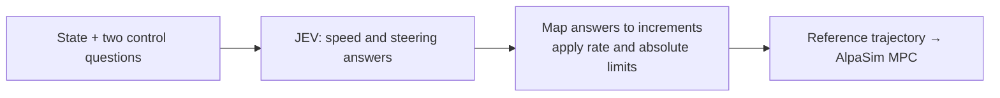

# From JEV answers to driving control

English | [简体中文](jev-control.zh-CN.md)

JEV selects **changes to the target speed and reference steering command**. Our code converts its structured answers into bounded commands and a reference trajectory; AlpaSim's MPC and vehicle dynamics execute that reference. The default mode is **Score**, with **Choice** available as an alternative.



## 1. What we ask JEV

Every decision uses one request containing the same scene state and two named questions:

| Question | Meaning | Direction |
|---|---|---|
| `speed` | How much should the current target speed change? | Positive = accelerate; negative = decelerate |
| `steering` | How much should the current reference steering command change? | Positive = left; negative = right |

The shared instructions tell JEV to follow the route, stay on drivable roads, avoid collisions and interpret the supplied traffic-control facts. Unknown signal phases remain unknown. JEV also receives measured ego motion, `current_target_speed_mps`, `commanded_steering_rad`, `decision_dt_s` and `vehicle_constraints`. The builders do not select a maneuver in advance.

Prompt `jev-drive-v1.3` explicitly prohibits wrong-way driving, crossing source road edges with any part of the ego vehicle, and collision or footprint overlap with actors. It asks JEV to consider dimensions, velocity and closing gaps, maintain braking clearance, and slow or stop before contact without assuming others will yield. These are textual requirements, not a safety override. `road.road_boundaries.edges` now carries original map RoadEdge polylines separately from lane dividers; clipping retains source vertices and does not invent ROI edges. These are open boundaries, not a closed drivable-area polygon or guaranteed map completeness. Lane-marking types still remain unknown. Earlier v1.2 experiments omitted this available source-map layer and have not been rerun with the correction.

Prompt `jev-drive-v1.2` replaces GT route geometry with [road-level navigation](navigation.md); lane choice and maneuver timing remain JEV decisions.

[questions.py](../src/jev_drive/policy/questions.py) constructs the exact instructions and criteria. The questions ask JEV to consider both axes, but their answers are separate judgments against the same state; one answer is not fed into the other question.

## 2. Default Score mode: a numerical control rubric

Each question has nine ordered criteria, indexed **0–8**, centered on **4 = zero increment**. The text of each criterion specifies a control change before limits. At the default gains:

| Score level | Target-speed increment (m/s) | Steering-command increment (rad) |
|---|---:|---:|
| 0 | −1.00 | −0.060 |
| 1 | −0.75 | −0.045 |
| 2 | −0.50 | −0.030 |
| 3 | −0.25 | −0.015 |
| 4 | 0.00 | 0.000 |
| 5 | +0.25 | +0.015 |
| 6 | +0.50 | +0.030 |
| 7 | +0.75 | +0.045 |
| 8 | +1.00 | +0.060 |

This is a rubric for **two separate questions**, not a requirement to choose the same row for both. JEV can return a fractional score, which produces a continuous increment:

```text
raw_delta_speed    = (speed.score    - 4) × speed_score_gain
raw_delta_steering = (steering.score - 4) × steering_score_gain

Default gains: 0.25 m/s per score level; 0.015 rad per score level.
```

The speed question asks for a signed target-speed increment, with levels ordered from deceleration to acceleration. The steering question asks for a signed increment added to the current command. For example, level 5's generated criteria are `Change target speed by +0.250 m/s before rate limits.` and `Change steering command by +0.0150 radians before rate limits.`

### Example answer and full command update

The following is an **illustrative valid answer**, not a recorded JEV driving result. Both probability maps include all nine keys:

```json
{
  "answers": {
    "speed": {
      "type": "score",
      "score": 7.5,
      "probabilities": {"0": 0, "1": 0, "2": 0, "3": 0, "4": 0, "5": 0, "6": 0, "7": 0.5, "8": 0.5}
    },
    "steering": {
      "type": "score",
      "score": 5.0,
      "probabilities": {"0": 0, "1": 0, "2": 0, "3": 0, "4": 0, "5": 1, "6": 0, "7": 0, "8": 0}
    }
  }
}
```

Start with target speed **10.0 m/s**, steering command **0.020 rad**, and a **0.2-second** decision interval:

| Stage | Speed | Steering |
|---|---|---|
| JEV score | 7.5 | 5.0 |
| Raw increment | `(7.5 − 4) × 0.25 = +0.875 m/s` | `(5 − 4) × 0.015 = +0.015 rad` |
| Rate-limited increment | `+0.600 m/s` | `+0.015 rad` |
| Updated command | **10.600 m/s** | **0.035 rad** |

The updated target is based on the **previous target**, not added to measured speed. Likewise, the steering increment is added to the previous reference command. A zero increment preserves that command.

[score_control.py](../src/jev_drive/control/score_control.py) uses the returned `score` directly after validation. The probability-weighted mean is logged as a diagnostic, not substituted for the score. Score probability sums may differ from 1 by at most 0.01 to accommodate rounded responses; only the diagnostic mean is normalized, and the original sum and raw response are logged. Choice retains the stricter 0.0001 sum tolerance. `confidence`, when present, is validated but does not scale or gate the control update.

## 3. Apply rate limits, then absolute limits

[limits.py](../src/jev_drive/control/limits.py) applies the same rules to Score and Choice answers:

```text
dv = clip(raw_delta_speed, -max_deceleration × dt, max_acceleration × dt)
ds = clip(raw_delta_steering, -max_steering_rate × dt, max_steering_rate × dt)

next_target_speed = clip(previous_target_speed + dv, min_speed, max_speed)
next_steering     = clip(previous_steering + ds, -max_abs_steering, max_abs_steering)
```

| Default bound | Value |
|---|---|
| Target acceleration/deceleration rate | ±3 m/s² → at most ±0.6 m/s per 0.2-second decision |
| Steering-command rate | ±0.8 rad/s → at most ±0.16 rad per decision |
| Target speed | 0–15 m/s |
| Reference steering command | −0.4 to +0.4 rad |

Thus the +0.875 m/s proposal above becomes +0.6 m/s. If the previous target were 14.8 m/s, the final target would be 15.0 m/s: an actual command increase of only 0.2 m/s. With default Score gains, steering proposals are already within the rate bound; the limiter still applies when gains or the decision interval change.

These are **command constraints**, not a guarantee that the simulated car's physical acceleration or steering exactly follows them. Actual motion comes from MPC and dynamics.

## 4. Alternative Choice mode

`configs/choice.json` asks for speed choices `accelerate / hold / decelerate` and steering choices `left / straight / right`. [choice_control.py](../src/jev_drive/control/choice_control.py) uses the **probability differences**, not just the winning label:

```text
raw_delta_speed    = choice_speed_gain    × (P(accelerate) - P(decelerate))
raw_delta_steering = choice_steering_gain × (P(left)       - P(right))

Default gains: 1.0 m/s and 0.06 rad.
```

For speed probabilities `(0.7, 0.2, 0.1)`, the increment is `+0.6 m/s`. For steering probabilities `(0.6, 0.3, 0.1)`, it is `+0.03 rad`. These then pass through the same limits. The `hold` and `straight` terms contribute zero to the difference; `straight` does not explicitly reset an existing steering command to zero.

## 5. Turn the command into a trajectory for MPC

[trajectory.py](../src/jev_drive/control/trajectory.py) uses updated target speed `v`, reference steering angle `δ` and wheelbase `L` (default **2.85 m**) to build a constant-curvature reference:

```text
R = L / tan(δ)
heading(t) = v × t / R
x(t) = R × sin(heading(t))
y(t) = R × (1 - cos(heading(t)))
```

Coordinates are ego-relative: +x forward, +y left. For near-zero steering (`|δ| < 0.001 rad`), the reference is straight: `x = v × t`, `y = 0`. Target speeds at or below 0.1 m/s are treated as zero for trajectory generation.

By default, the reference covers **4 seconds at 10 Hz**: 40 future poses. [The driver](../src/jev_drive/integration/driver_service.py) transforms them to world coordinates and prepends the current pose, returning 41 timestamped poses through gRPC. AlpaSim executes the next 0.2-second interval before the next JEV decision replaces the reference. JEV does not directly output throttle, brake or a guaranteed next vehicle pose.

## 6. State and validation

On the first decision, [ControlState.initialize](../src/jev_drive/control/control_state.py) initializes the target from ego speed clipped to the target bounds. It estimates reference steering from yaw rate using `atan(L × yaw_rate / target_speed)` when target speed exceeds 0.25 m/s, otherwise zero, then applies angle bounds. Subsequent updates reuse the session's previous commands.

Answer types, probability keys, finite numbers, probability bounds/sums and score ranges are validated. Choice labels must agree with a maximum-probability option. Invalid answers fail the rollout; there is no substitute policy. An identical duplicate request reuses the cached result, so an increment is not applied twice.

To inspect the conversion, read `raw_response`, `control_before`, `increments`, `control` and `trajectory` in a decision event in `decisions.jsonl`. These record the model answer, raw/rate-limited/applied changes, final command and reference. `outcome` events record the actual simulated motion.

Return to the [five-module workflow](full-workflow.md) or inspect the [BEV input guide](bev-state-guide.md).

The optional `api_503_retries` setting (default `0`, maximum `10`) retries a temporary HTTP 503 with the identical request while simulation time is paused. It honors `Retry-After` or uses the configured backoff. The limit applies per decision, including when 429 responses occur between 503 responses; exhausting it fails the rollout.

Map polylines are serialized to millimetre precision to limit input size; raw scene snapshots retain their original precision.
