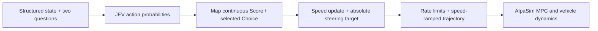

# From JEV answers to driving control

English | [简体中文](jev-control.zh-CN.md)

Prompt **`jev-drive-v1.8`** asks JEV for a speed action and an **absolute reference steering target**. The model chooses the driving action; our code applies command limits and generates a reference for AlpaSim's MPC.



## Questions and safety instructions

The shared prompt requires the whole vehicle to remain within source road edges, avoid collision, follow lane travel directions, avoid shoulders and respect known traffic-control facts. Road-corridor navigation does not prescribe GT waypoints or override safety. Unknown signals remain unknown. These are model instructions, not a collision-prevention guarantee.

Every level is a standalone semantic description: it names a driving situation and the corresponding action. Steering levels distinguish a sharp bend or large path error from a broad bend or small error, and specify the correction direction. Straight means **zero reference steering**, unwinding the previous turn within the steering-rate limit. It does not mean maintaining an existing turn. Exact English criteria are in [questions.py](../src/jev_drive/policy/questions.py).

In v1.8, every Score criterion and Choice label also states its numerical speed increment (m/s) or absolute steering target (rad). These descriptions and execution share `control/action_mapping.py`. The model receives `vehicle_constraints.control_mapping`: the active action table, rate/absolute-limit equations, gradual overspeed recovery, and the speed-ramp/constant-curvature reference equations. Values are generated from the active configuration. The prompt version changes because existing v1.5 answers were produced without this contract and cannot seed v1.8 rollouts.

## Score mode

Each axis has nine ordered descriptions whose integer levels anchor a continuous mapping. After validating the score and probabilities, we map the **API-reported continuous `score`** through a neutral deadzone to control. We do not select the modal level or replace the reported score with a locally recomputed mean. Tied maximum probabilities are valid.

| Level | Speed action | Steering target |Default steering angle|
|---:|---|---|---:|
| 0 | Strongest allowed braking for imminent danger | Strong right | -0.060000 rad |
| 1 | Firm braking for rapidly closing hazards | Firm right | -0.044615 rad |
| 2 | Moderate slowing for reduced clearance | Moderate right | -0.029231 rad |
| 3 | Gentle slowing for modest excess speed | Gentle right | -0.013846 rad |
| 4 | Maintain an appropriate target speed | Straight; unwind previous turn | +0.000000 rad |
| 5 | Gentle acceleration with clear space | Gentle left | +0.013846 rad |
| 6 | Moderate acceleration on an open lane | Moderate left | +0.029231 rad |
| 7 | Firm acceleration when substantially too slow | Firm left | +0.044615 rad |
| 8 | Strongest allowed acceleration from low speed with ample clearance | Strong left | +0.060000 rad |

These are two separate questions, not paired actions. Each criterion includes its situation and numeric anchor; the model also receives the continuous mapping and limiting equations.

```text
h(s) = 0 when 4-w <= s <= 4+w
h(s) = sign(s-4) × max(abs(s-4)-w, 0) × 4/(4-w) otherwise
speed increment = h(returned_speed_score) × speed_score_gain
steering target = h(returned_steering_score) × steering_score_gain
steering change = steering target − previous steering command
```

Default `score_deadzone=0.1` makes scores in [3.9,4.1], inclusive, request zero speed increment and zero absolute steering. Outside this interval, the mapping grows continuously and rescales to preserve endpoint magnitudes. Default gains remain 0.25 m/s and 0.015 rad; scores 0 and 8 still request ±1 m/s and ±0.06 rad before limits. Set the configurable half-width to 0 to disable the deadzone. Neutral speed holds the target except during initial overspeed recovery; neutral steering unwinds the previous turn under rate limits.

## Choice mode

Choice executes its returned, validated `choice` label, rather than a probability difference. `accelerate`, `hold` and `decelerate` request `+choice_speed_gain`, zero and `−choice_speed_gain`. `left`, `straight` and `right` request absolute steering targets `+choice_steering_gain`, zero and `−choice_steering_gain`.

Default gains are 1 m/s and 0.06 rad. The same rate limits apply. Straight explicitly returns the steering reference toward zero in both modes.

## Initialization and limits

The initial command speed equals measured forward speed, **including speeds above the configured cap**. Initial steering is estimated from measured yaw rate and that same actual speed. Negative initial longitudinal speed is unsupported and rejected.

Normal speed commands use the configured acceleration/deceleration and speed bounds. If the initial target exceeds the cap, it is brought down gradually at the configured deceleration rate; the command can temporarily remain above the cap during this recovery. This is necessary to avoid an instantaneous speed discontinuity.

For a 31.23 m/s start, 15 m/s cap and 3 m/s² deceleration limit, the first 0.2-second update is **30.63 m/s**, not 15 m/s. Steering targets are also subject to absolute-angle and rate limits.

## Reference trajectory and execution

The four-second reference starts at **measured speed** and ramps toward the updated target under the configured acceleration limits. Distance is the integral of that speed profile. The bicycle model maps distance to position and heading using constant reference curvature `tan(steering) / wheelbase`; references are regenerated every 0.2 seconds.

The command and reference limits do not mathematically guarantee identical limits on the vehicle's measured acceleration: MPC tracking and vehicle dynamics can differ. Native-controller regression tests cover the high-speed-start case, in addition to analytic command/reference checks.

## Audit and compatibility

`decisions.jsonl` retains `raw_response`, `score_diagnostics.control_score`, `control_before`, `increments.requested_steering_target_rad`, `control`, and the trajectory's speed profile. Outcome events record actual simulated motion. Identical duplicate requests are cached, so their actions are not applied twice.

v1.8 replaces v1.5/v1.6 modal selection with continuous Score mapping. Old responses cannot seed v1.8 rollouts; recovery checks prompt versions. Old experiments and GIFs remain historical records.

See [recovery and coverage](recovery.md), [road navigation](navigation.md) and [structured input facts](input-facts.md).
