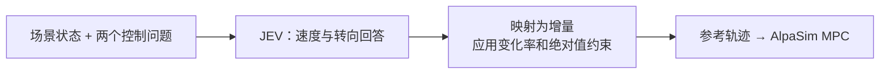

# 从 JEV 回答到驾驶控制

[English](jev-control.md) | 简体中文

JEV 选择**目标速度和参考转向指令的变化量**。程序把结构化回答转换成受约束的指令及参考轨迹，再由 AlpaSim 的 MPC 与车辆动力学执行。默认使用 **Score**，也支持 **Choice** 模式。



## 1. 我们如何向 JEV 提问

每次决策只发送一个请求，包含同一份场景状态和两个命名问题：

| 问题 | 含义 | 方向 |
|---|---|---|
| `speed` | 当前目标速度应该变化多少？ | 正值加速，负值减速 |
| `steering` | 当前参考转向指令应该变化多少？ | 正值向左，负值向右 |

共同指令要求 JEV 遵循导航、保持在可行驶道路内、避免碰撞并理解提供的交通控制事实；未知信号相位仍然是未知。输入还包含实际自车运动、`current_target_speed_mps`、`commanded_steering_rad`、`decision_dt_s` 和 `vehicle_constraints`。状态构建器不会提前替 JEV 选择驾驶动作。

提示词 `jev-drive-v1.3` 明确禁止逆行、车身任何部分跨越源道路边界，以及与对象碰撞或包围盒重叠；要求结合尺寸、速度和接近趋势保留制动空间，必要时在接触前减速或停车，不假定其他车辆会避让。这些是文字要求，不是安全接管。`road.road_boundaries.edges` 现单独提供原始地图 RoadEdge 折线，与车道分界线分开；裁剪保留源顶点，不虚构 ROI 外框。这些是开放边界线，不是闭合可行驶区域，也不保证地图完整性。v1.4 已从原始顶点补入标线样式和颜色。此前 v1.2 实验遗漏了源地图本来存在的这一层，尚未使用此修正重跑。

提示词 `jev-drive-v1.2` 将 GT 路径几何替换为[道路级导航](navigation.zh-CN.md)，车道选择和换道时机仍由 JEV 决定。

[questions.py](../src/jev_drive/policy/questions.py) 生成实际指令与评分标准。问题要求考虑两个控制轴，但回答是对同一状态的两个独立判断，并不是先得到一个回答再输入另一个问题。

## 2. 默认 Score 模式：把控制变化写成评分标准

每个问题有 **0–8 共九档**有序标准，以 **4 = 零增量** 为中心。每档文字直接说明应用约束前的控制变化。默认增益对应如下：

| 分数档位 | 目标速度增量（m/s） | 转向指令增量（rad） |
|---|---:|---:|
| 0 | −1.00 | −0.060 |
| 1 | −0.75 | −0.045 |
| 2 | −0.50 | −0.030 |
| 3 | −0.25 | −0.015 |
| 4 | 0.00 | 0.000 |
| 5 | +0.25 | +0.015 |
| 6 | +0.50 | +0.030 |
| 7 | +0.75 | +0.045 |
| 8 | +1.00 | +0.060 |

这是**两个不同问题**各自的标准，不要求速度和转向选同一行。JEV 可以返回小数分数，从而产生连续增量：

```text
raw_delta_speed    = (speed.score    - 4) × speed_score_gain
raw_delta_steering = (steering.score - 4) × steering_score_gain

默认增益：每分 0.25 m/s；每分 0.015 rad。
```

速度问题询问从减速到加速的有符号目标速度增量，转向问题询问要加到当前指令上的有符号增量。例如，第 5 档实际生成的英文标准分别是 `Change target speed by +0.250 m/s before rate limits.` 和 `Change steering command by +0.0150 radians before rate limits.`，即先提出 +0.250 m/s 和 +0.0150 rad，再由程序执行约束。

### 一个回答如何完整转换为控制指令

以下是**示意性的有效回答**，不是真实录制的 JEV 驾驶结果。两个概率表都包含全部九个键：

```json
{
  "answers": {
    "speed": {
      "type": "score",
      "score": 7.5,
      "probabilities": {"0": 0, "1": 0, "2": 0, "3": 0, "4": 0, "5": 0, "6": 0, "7": 0.5, "8": 0.5}
    },
    "steering": {
      "type": "score",
      "score": 5.0,
      "probabilities": {"0": 0, "1": 0, "2": 0, "3": 0, "4": 0, "5": 1, "6": 0, "7": 0, "8": 0}
    }
  }
}
```

假设已有目标速度为 **10.0 m/s**、转向指令为 **0.020 rad**，决策间隔为 **0.2 秒**：

| 阶段 | 速度 | 转向 |
|---|---|---|
| JEV 分数 | 7.5 | 5.0 |
| 原始增量 | `(7.5 − 4) × 0.25 = +0.875 m/s` | `(5 − 4) × 0.015 = +0.015 rad` |
| 变化率约束后 | `+0.600 m/s` | `+0.015 rad` |
| 更新后的指令 | **10.600 m/s** | **0.035 rad** |

更新以**上一次目标速度**为基准，不是将增量加到实际测得的速度上。转向增量同样加到之前的参考转向指令上；零增量保持已有指令。

[score_control.py](../src/jev_drive/control/score_control.py) 校验后直接使用返回的 `score`。概率加权均值只用于记录诊断，不替代该分数。Score 概率总和与 1 的差最多允许 0.01，以兼容回答中的小幅舍入误差；仅诊断均值做归一化，原始概率总和及完整回答都会保留。Choice 仍使用更严格的 0.0001 总和容差。可选的 `confidence` 会被校验，但不参与控制缩放或决定是否执行。

## 3. 先限制变化率，再限制绝对值

[limits.py](../src/jev_drive/control/limits.py) 对 Score 和 Choice 使用相同规则：

```text
dv = clip(raw_delta_speed, -max_deceleration × dt, max_acceleration × dt)
ds = clip(raw_delta_steering, -max_steering_rate × dt, max_steering_rate × dt)

next_target_speed = clip(previous_target_speed + dv, min_speed, max_speed)
next_steering     = clip(previous_steering + ds, -max_abs_steering, max_abs_steering)
```

| 默认约束 | 数值 |
|---|---|
| 目标加减速率 | ±3 m/s²，即每 0.2 秒最多变化 ±0.6 m/s |
| 转向指令变化率 | ±0.8 rad/s，即每次最多变化 ±0.16 rad |
| 目标速度 | 0–15 m/s |
| 参考转向指令 | −0.4 至 +0.4 rad |

因此，上例提出的 +0.875 m/s 会被限制为 +0.6 m/s。如果已有目标是 14.8 m/s，最终只能达到 15.0 m/s，真正应用的增量是 +0.2 m/s。默认 Score 增益下，转向增量已落在变化率边界内；调整增益或决策间隔后，该约束仍会生效。

这些是**控制指令约束**，不保证仿真车辆的实际加速度或转向完全一致。实际运动由 MPC 和动力学决定。

## 4. 可选 Choice 模式

`configs/choice.json` 对速度提供 `accelerate / hold / decelerate`，对转向提供 `left / straight / right`。[choice_control.py](../src/jev_drive/control/choice_control.py) 使用**概率差**，不只是执行概率最大的标签：

```text
raw_delta_speed    = choice_speed_gain    × (P(accelerate) - P(decelerate))
raw_delta_steering = choice_steering_gain × (P(left)       - P(right))

默认增益：1.0 m/s 和 0.06 rad。
```

速度概率为 `(0.7, 0.2, 0.1)` 时，增量为 `+0.6 m/s`；转向概率为 `(0.6, 0.3, 0.1)` 时，增量为 `+0.03 rad`，之后经过相同约束。`hold` 和 `straight` 对差值的贡献为零；`straight` 不会显式把已有转向指令重置为零。

## 5. 将控制指令转成 MPC 的参考轨迹

[trajectory.py](../src/jev_drive/control/trajectory.py) 用更新后的目标速度 `v`、参考转向角 `δ`、轴距 `L`（默认 **2.85 米**）生成恒曲率参考：

```text
R = L / tan(δ)
heading(t) = v × t / R
x(t) = R × sin(heading(t))
y(t) = R × (1 - cos(heading(t)))
```

坐标相对自车，+x 向前、+y 向左。转向接近零（`|δ| < 0.001 rad`）时，使用直线参考 `x = v × t`、`y = 0`。生成轨迹时，目标速度不超过 0.1 m/s 会按零处理。

默认轨迹时域 **4 秒、采样频率 10 Hz**，得到 40 个未来位姿。[驱动](../src/jev_drive/integration/driver_service.py) 将其转到世界坐标并添加当前位姿，通过 gRPC 返回 41 个带时间戳的位姿。AlpaSim 执行下一个 0.2 秒区间后，再由下一次 JEV 决策更新参考。JEV 不直接输出油门、刹车，也不直接保证下一时刻的车辆位姿。

## 6. 状态保存与回答校验

首次决策时，[ControlState.initialize](../src/jev_drive/control/control_state.py) 将实际自车速度裁剪到目标速度范围内作为初值。当目标速度大于 0.25 m/s 时，以 `atan(L × yaw_rate / target_speed)` 估计参考转向，否则取零，再应用角度边界。后续更新继续使用该会话已有的控制指令。

程序校验回答类型、概率键、数值有限性、概率范围及总和、分数范围。Choice 标签必须对应最大概率选项之一。无效回答会令本次仿真失败，不会使用替代策略。完全相同的重复请求使用缓存结果，避免重复应用增量。

在 `decisions.jsonl` 的决策事件中查看 `raw_response`、`control_before`、`increments`、`control` 和 `trajectory`，即可分别看到模型回答、转换前状态、原始/限速率后/实际应用的增量、最终指令及参考轨迹。`outcome` 事件记录实际仿真运动。

返回 [五模块流程图](full-workflow.zh-CN.md)，或查看 [BEV 输入图解](bev-state-guide.zh-CN.md)。

可选配置 `api_503_retries`（默认 `0`，最大 `10`）允许对临时 HTTP 503 使用相同输入重试，期间仿真暂停。等待时间优先使用 `Retry-After`，否则使用配置的退避间隔。次数上限按每个决策计算，503 之间出现 429 也不会重置计数；超过上限后本次仿真失败。

地图折线以毫米精度输出，减少模型输入体积；原始场景快照保留完整精度。

[当前输入修正（v1.4）](input-facts.zh-CN.md)：原始车道属性、路肩排除、区域几何、交通控制关联与观测范围。
