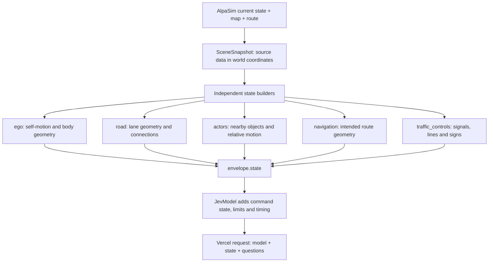
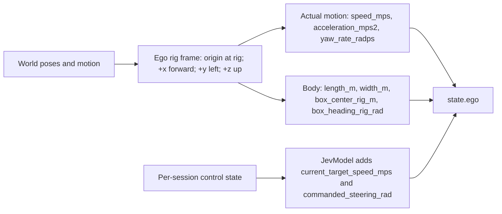
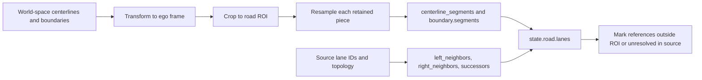
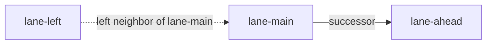
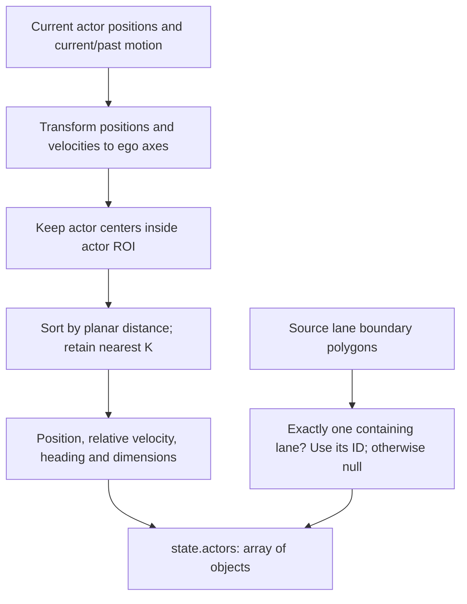
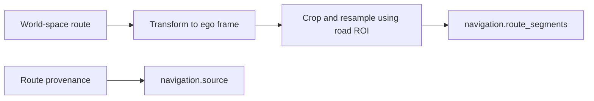
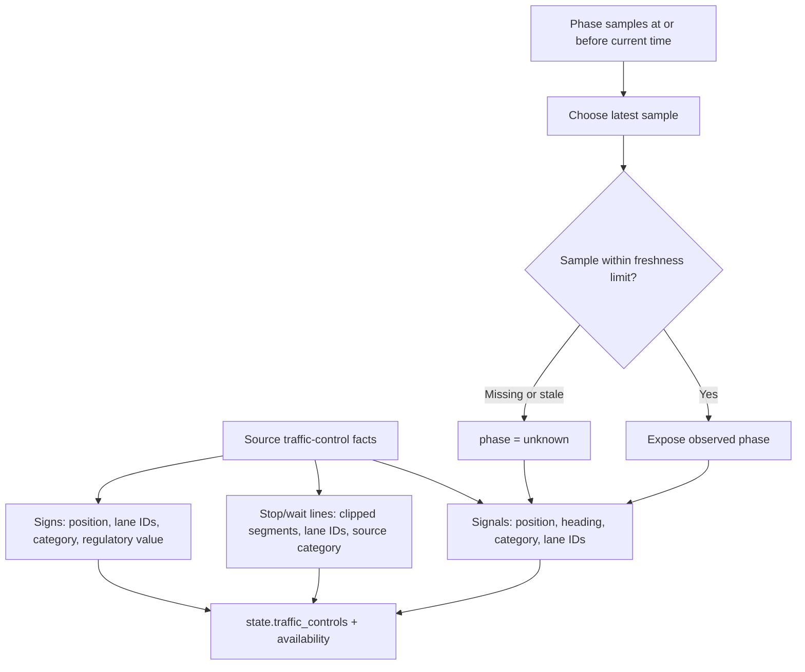
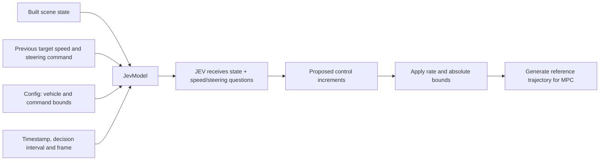

# Structured state: a visual guide

These diagrams follow the current Python builders. All numbers and IDs below are **illustrative**, not measurements from a recorded scene. JSON snippets show selected fields, not complete requests. GitHub renders the Mermaid diagrams directly.

## 1. From the simulator to JEV



The runtime-to-driver **envelope** also carries `session_id`, `scene_id`, `step_index`, `timestamp_us`, `decision_dt_s`, `coordinate_frame` and `provenance`. It travels in `DriveRequest.renderer_data`. The API receives the assembled **state**, not the entire envelope; session IDs, provenance and preserved renderer bytes are not added to the API state by this implementation.

Code: [state_builder.py](../src/jev_drive/state/state_builder.py), [jev_model.py](../src/jev_drive/policy/jev_model.py).

## 2. Ego: a local origin, actual motion and previous commands



Top view (the vehicle faces upward on this page):

```text
                    +x: forward
                         ↑
                         |      actor at (20, -3)
                         |          ●  right
          +y: left ← rig origin
                        (0, 0)
```

```json
{
  "ego": {
    "speed_mps": 10.0,
    "acceleration_mps2": 0.2,
    "yaw_rate_radps": 0.01,
    "length_m": 4.8,
    "width_m": 1.9,
    "box_center_rig_m": [1.2, 0.0, 0.8],
    "box_heading_rig_rad": 0.0,
    "current_target_speed_mps": 10.5,
    "commanded_steering_rad": 0.02
  }
}
```

`speed_mps` is the longitudinal velocity component, not the norm of a 3D velocity. The physical box center can differ from the rig origin. Measured motion and commanded targets are separate fields: a target of 10.5 m/s does not mean the car already travels at that speed. On the first decision, command state is initialized from available ego kinematics.

Code: [ego.py](../src/jev_drive/state/ego.py), [coordinates.py](../src/jev_drive/state/coordinates.py), [control_state.py](../src/jev_drive/control/control_state.py).

## 3. Roads: geometry plus lane connections



Lane relationships form a graph, separate from the sampled geometry:



```json
{
  "road": {
    "roi_m": [-20, 80, -15, 15],
    "lanes": [{
      "id": "lane-main",
      "centerline_segments": [[[0, 0], [5, 0], [10, 0]]],
      "left_boundary": {"type": "unknown", "segments": [[[0, 1.8], [5, 1.8]]]},
      "left_neighbors": ["lane-left"],
      "right_neighbors": [],
      "successors": ["lane-ahead"],
      "references_outside_roi": ["lane-ahead"],
      "unresolved_references": []
    }]
  }
}
```

ROI order is `[x_min, x_max, y_min, y_max]` in meters. Defaults retain 20 m behind, 80 m ahead and 15 m on either side. Default resampling spacing is 5 m, with segment endpoints retained. A polyline that exits and re-enters the ROI becomes multiple `segments`; never draw a connecting line across their gap. A known lane outside the crop is different from an ID absent from the source map.

Code: [road_graph.py](../src/jev_drive/state/road_graph.py).

## 4. Actors: nearby objects with relative motion



```json
{
  "actors": [{
    "id": "vehicle-7",
    "type": "vehicle",
    "source_type": "automobile",
    "lane_id": "lane-main",
    "x_m": 20.0,
    "y_m": -3.0,
    "relative_vx_mps": -2.0,
    "relative_vy_mps": 0.0,
    "velocity_source": "illustrative-source",
    "heading_rad": 0.0,
    "length_m": 4.5,
    "width_m": 1.8
  }]
}
```

Here the actor is 20 m forward and 3 m right. For parallel forward motion, `relative_vx_mps = -2` means its longitudinal velocity is 2 m/s below ego's. Relative velocity is `(actor world velocity − ego world velocity)` rotated into ego axes; it does not include a rotating-frame position-derivative correction.

Defaults: ROI `[-30, 80, -20, 20]`, at most 16 actors. Missing velocity yields `null` components, not zero. Multiple lane matches yield `lane_id: null`. No `lead_vehicle`, collision-risk, TTC or maneuver label is added.

Code: [actors.py](../src/jev_drive/state/actors.py), [lane_matching.py](../src/jev_drive/state/lane_matching.py).

## 5. Navigation: route geometry, separate from the road map



```json
{
  "navigation": {
    "route_segments": [[[0, 0], [5, 0], [10, 1], [14, 4]]],
    "source": "illustrative-route-source"
  }
}
```

The road graph describes lane geometry and connectivity; navigation supplies the intended route. It is not converted into a preselected steering command. Route pieces remain separate after clipping. Route intent may extend ahead; this does not expose future actor or signal observations.

Code: [navigation.py](../src/jev_drive/state/navigation.py).

## 6. Traffic controls: signals, stop lines and signs



```json
{
  "traffic_controls": {
    "signals": [{
      "id": "signal-1",
      "position_m": [25, 2, 5],
      "applies_to_lane_ids": ["lane-main"],
      "phase": "unknown",
      "phase_timestamp_us": null,
      "phase_source": "unavailable",
      "phase_stale": false
    }],
    "stop_lines": [{
      "id": "line-1",
      "segments": [[[22, -1.8], [22, 1.8]]],
      "lane_ids": ["lane-main"],
      "source_category": "illustrative-map-category",
      "is_implicit": false
    }],
    "signs": [{
      "id": "sign-1",
      "position_m": [18, -3, 2],
      "source_category": "illustrative-map-category",
      "lane_ids": [],
      "regulatory_value": null
    }]
  }
}
```

Static signal geometry does not imply red or green. Default phase freshness is 1 second. An old sample keeps its timestamp/source and sets `phase_stale: true`, while reporting `phase: unknown`; no sample has a null timestamp and `phase_stale: false`. Future samples are excluded. `availability` records adapter-provided source availability; empty arrays alone do not prove that a scene has no controls. Raw categories are preserved rather than translated into `must_stop` or `should_yield` recommendations.

Code: [traffic_controls.py](../src/jev_drive/state/traffic_controls.py), [traffic_signals.py](../src/jev_drive/state/traffic_signals.py), [stop_lines.py](../src/jev_drive/state/stop_lines.py), [traffic_signs.py](../src/jev_drive/state/traffic_signs.py).

## 7. Command context and vehicle constraints



```json
{
  "decision_dt_s": 0.2,
  "timestamp_us": 1000000,
  "coordinate_frame": "ego_rig_x_forward_y_left_z_up",
  "vehicle_constraints": {
    "min_target_speed_mps": 0.0,
    "max_target_speed_mps": 15.0,
    "max_abs_steering_rad": 0.4,
    "max_acceleration_mps2": 3.0,
    "max_deceleration_mps2": 3.0,
    "max_steering_rate_radps": 0.8,
    "wheelbase_m": 2.85
  }
}
```

These fields are added by `JevModel`, so a builder-only `state.json` does not yet contain them or the two command fields under `ego`. At the defaults, one decision changes target speed by at most 0.6 m/s and steering command by at most 0.16 rad, also subject to absolute bounds. These constrain commands; actual simulated motion comes from AlpaSim.

To inspect the exact input sent for a completed decision, open its `state` in `outputs/<run>/decisions.jsonl`. This includes all model-added context. To debug only state construction, inspect the `state` object inside the envelope in `outputs/<snapshot>/state.json`.

Code: [vehicle_constraints.py](../src/jev_drive/state/vehicle_constraints.py), [jev_model.py](../src/jev_drive/policy/jev_model.py), [limits.py](../src/jev_drive/control/limits.py).
