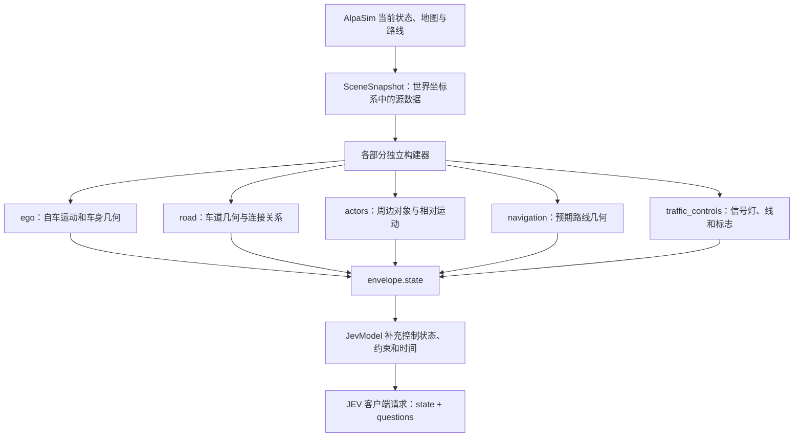
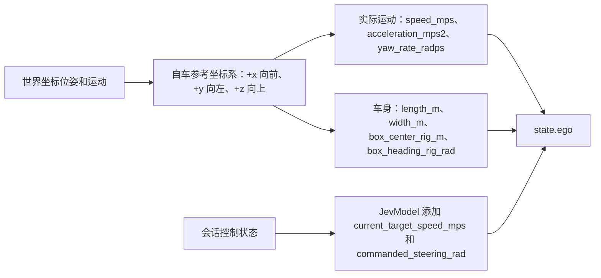
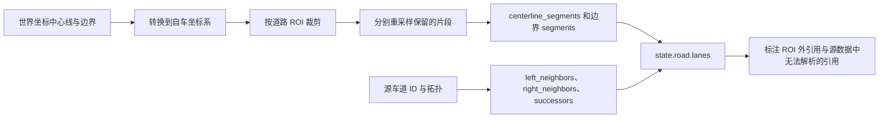
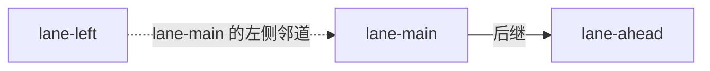
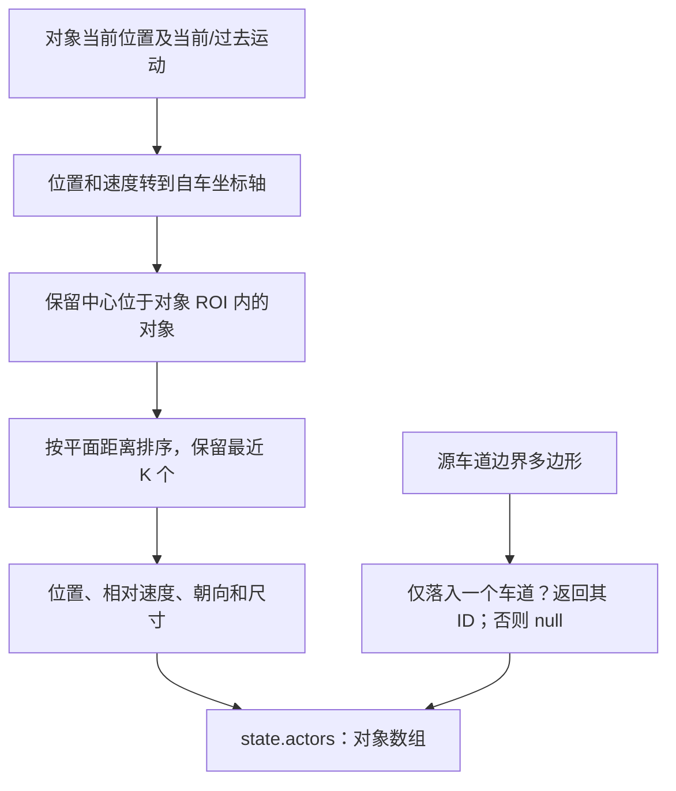
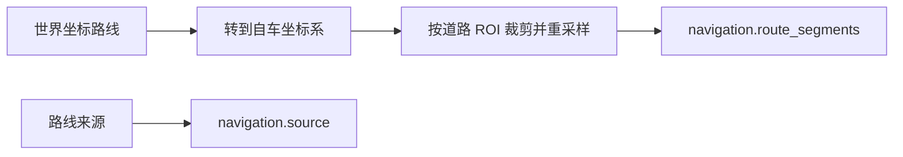
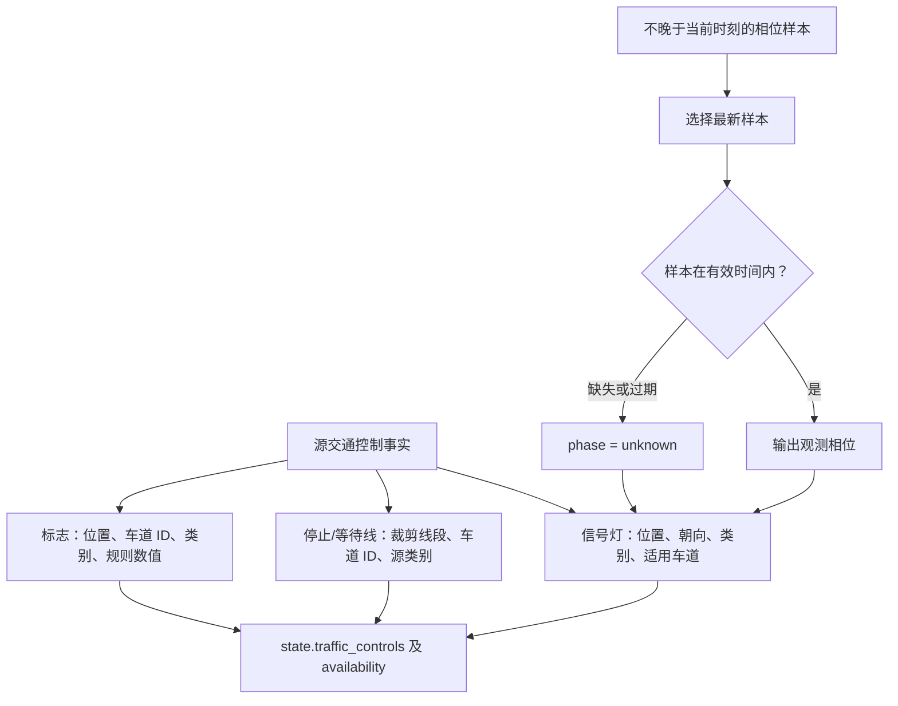
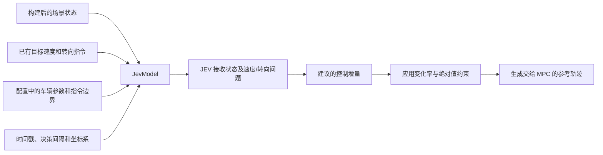

# 结构化状态图解

[English](structured-state.md) | 简体中文

真实场景和字段的对照请先看 [BEV 图解](bev-state-guide.zh-CN.md)。本页依据当前 Python 构建器说明数据结构；以下数值和 ID 均为**示意值**，不是录制场景的测量值。JSON 片段仅展示部分字段，不是完整请求。GitHub 可直接渲染 Mermaid 图。

仿真整体生命周期见 [完整实现流程](full-workflow.zh-CN.md)。

## 1. 从仿真器到 JEV



运行时到驱动的**封装 envelope** 还含 `session_id`、`scene_id`、`step_index`、`timestamp_us`、`decision_dt_s`、`coordinate_frame` 和 `provenance`，通过 `DriveRequest.renderer_data` 传输。API 收到的是组装后的 **state**，不是整个 envelope；本实现不会把会话 ID、provenance 或保留的渲染数据加入 API state。

源码：[state_builder.py](../src/jev_drive/state/state_builder.py)、[jev_model.py](../src/jev_drive/policy/jev_model.py)。

## 2. 自车：局部原点、实际运动和已有指令



俯视示意，自车朝向页面上方：

```text
                    +x：前方
                         ↑
                         |      对象位于 (20, -3)
                         |          ●  右侧
          +y：左侧 ← 参考原点
                        (0, 0)
```

```json
{
  "ego": {
    "speed_mps": 10.0,
    "acceleration_mps2": 0.2,
    "yaw_rate_radps": 0.01,
    "length_m": 4.8,
    "width_m": 1.9,
    "box_center_rig_m": [1.2, 0.0, 0.8],
    "box_heading_rig_rad": 0.0,
    "current_target_speed_mps": 10.5,
    "commanded_steering_rad": 0.02
  }
}
```

`speed_mps` 是纵向速度分量，不是三维速度的模长。车身包围盒中心可以偏离参考原点。实际运动和指令目标是不同字段：目标为 10.5 m/s 不意味着车辆已达到该速度。第一次决策时，根据可用自车运动学信息初始化控制状态。

源码：[ego.py](../src/jev_drive/state/ego.py)、[coordinates.py](../src/jev_drive/state/coordinates.py)、[control_state.py](../src/jev_drive/control/control_state.py)。

## 3. 道路：几何与车道连接



车道关系构成图，与采样几何分开表达：



```json
{
  "road": {
    "roi_m": [-20, 80, -15, 15],
    "lanes": [{
      "id": "lane-main",
      "centerline_segments": [[[0, 0], [5, 0], [10, 0]]],
      "left_boundary": {"type": "unknown", "segments": [[[0, 1.8], [5, 1.8]]]},
      "left_neighbors": ["lane-left"],
      "right_neighbors": [],
      "successors": ["lane-ahead"],
      "references_outside_roi": ["lane-ahead"],
      "unresolved_references": []
    }]
  }
}
```

ROI 按 `[x_min, x_max, y_min, y_max]` 排列，单位米。默认保留后方 20 米、前方 80 米及左右各 15 米。默认采样间隔 5 米，保留线段端点。折线离开再进入 ROI 时会成为多个 `segments`，不能跨空隙连线。已知但在 ROI 外的车道引用，与源地图中不存在的 ID 是不同情况。

源码：[road_graph.py](../src/jev_drive/state/road_graph.py)。

## 4. 周边对象：位置与相对运动



```json
{
  "actors": [{
    "id": "vehicle-7",
    "type": "vehicle",
    "source_type": "automobile",
    "lane_id": "lane-main",
    "x_m": 20.0,
    "y_m": -3.0,
    "relative_vx_mps": -2.0,
    "relative_vy_mps": 0.0,
    "velocity_source": "illustrative-source",
    "heading_rad": 0.0,
    "length_m": 4.5,
    "width_m": 1.8
  }]
}
```

示例对象在前方 20 米、右方 3 米。对于同向平行运动，`relative_vx_mps = -2` 表示其纵向速度比自车低 2 m/s。相对速度等于“对象世界坐标速度 − 自车世界坐标速度”，再旋转到自车坐标轴；它不包含旋转坐标系下位置导数的额外修正项。

默认对象 ROI 为 `[-30, 80, -20, 20]`，最多 16 个对象。未知速度分量为 `null`，不是零；多个车道匹配时 `lane_id` 为 `null`。构建器不添加“前车”、碰撞风险、TTC 或驾驶动作标签。

源码：[actors.py](../src/jev_drive/state/actors.py)、[lane_matching.py](../src/jev_drive/state/lane_matching.py)。

## 5. 导航：独立于道路地图的路线



```json
{
  "navigation": {
    "route_segments": [[[0, 0], [5, 0], [10, 1], [14, 4]]],
    "source": "illustrative-route-source"
  }
}
```

道路图描述车道几何与连接，导航提供预期路线。构建器不会把它直接变成预选转向动作，裁剪后的不连续片段仍分开保存。路线意图可以向前延伸，但不会因此暴露未来对象运动或信号灯观测。

源码：[navigation.py](../src/jev_drive/state/navigation.py)。

## 6. 交通控制：信号灯、停止线与标志



```json
{
  "traffic_controls": {
    "signals": [{
      "id": "signal-1",
      "position_m": [25, 2, 5],
      "applies_to_lane_ids": ["lane-main"],
      "phase": "unknown",
      "phase_timestamp_us": null,
      "phase_source": "unavailable",
      "phase_stale": false
    }],
    "stop_lines": [{
      "id": "line-1",
      "segments": [[[22, -1.8], [22, 1.8]]],
      "lane_ids": ["lane-main"],
      "source_category": "illustrative-map-category",
      "is_implicit": false
    }],
    "signs": [{
      "id": "sign-1",
      "position_m": [18, -3, 2],
      "source_category": "illustrative-map-category",
      "lane_ids": [],
      "regulatory_value": null
    }]
  }
}
```

静态信号灯几何不能确定红灯或绿灯。默认相位有效期为 1 秒。过期样本保留时间戳和来源，设置 `phase_stale: true`，同时令 `phase: unknown`；完全没有样本时，时间戳为 null，`phase_stale: false`。未来样本被排除。

`availability` 记录适配器提供的源数据可用性。空数组本身不能证明场景没有交通控制对象。原始类别保留，不转成 `must_stop` 或 `should_yield` 之类的决策建议。

源码：[traffic_controls.py](../src/jev_drive/state/traffic_controls.py)、[traffic_signals.py](../src/jev_drive/state/traffic_signals.py)、[stop_lines.py](../src/jev_drive/state/stop_lines.py)、[traffic_signs.py](../src/jev_drive/state/traffic_signs.py)。

## 7. 控制上下文和车辆约束



```json
{
  "decision_dt_s": 0.2,
  "timestamp_us": 1000000,
  "coordinate_frame": "ego_rig_x_forward_y_left_z_up",
  "vehicle_constraints": {
    "min_target_speed_mps": 0.0,
    "max_target_speed_mps": 15.0,
    "max_abs_steering_rad": 0.4,
    "max_acceleration_mps2": 3.0,
    "max_deceleration_mps2": 3.0,
    "max_steering_rate_radps": 0.8,
    "wheelbase_m": 2.85
  }
}
```

这些字段由 `JevModel` 添加，单独构建得到的 `state.json` 尚不含它们，也不含 `ego` 内的两个控制指令字段。默认情况下，每次决策的目标速度变化最多 0.6 m/s、转向指令变化最多 0.16 rad，同时受绝对值边界限制。这些是指令约束，实际车辆运动由 AlpaSim 计算。

要查看一次已完成决策实际发出的输入，读取 `outputs/<run>/decisions.jsonl` 中该决策的 `state`，其中含模型添加的全部上下文。只调试状态构建时，查看 `outputs/<snapshot>/state.json` 封装内的 `state` 对象。

源码：[vehicle_constraints.py](../src/jev_drive/state/vehicle_constraints.py)、[jev_model.py](../src/jev_drive/policy/jev_model.py)、[limits.py](../src/jev_drive/control/limits.py)。
